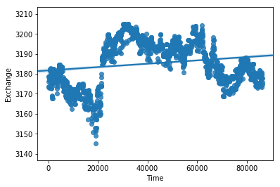
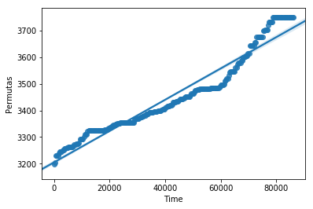

# Web Project

### Comparativa de precios de criptoactivos entre datos obtenidos del exchange Bitstamp (API) y la plataforma de P2P LocalBitcoins (Scraping)

#### by Octavio Garcia (Data Analytics Bootcamp 2019)

## Alcance
En el presente proyecto se realiza un ejercicio académico de extracción de datos utilizando 2 técnicas diferentes, con el objetivo de relacionar dichos datos enriqueciendo así el dataset.
- **Obtención de datos mediante API REST**. Se han obtenido más de 5.000 registros correspondientes a las transacciones realizadas en 1 día del par BTC-EUR dentro del exchange Bitstamp (https://www.bitstamp.net/api/). Dichos datos han sido tratados con el objetivo de determinar la tendencia del precio del BTC en EUROS durante un periodo de 24 horas.
- **Obtención de datos mediante WEB SCRAPING**. Se han obtenido 500 registros correspondientes a las ofertas publicadas en el portal de permutas P2P Local Bitcoins. En dicho portal los usuarios registrados ofrecen pequeñas cantidades de BTC a otros usuarios. Esta plataforma es ampliamente utilizada en regiones con problemas importantes de devaluación monetaria. No obstante, para efectos de este proyecto, se ha limitado la adquisición de datos a las ofertas realizadas en EUROS. Cabe indicar que la plataforma posee una API (https://localbitcoins.com//buy-bitcoins-online/EUR/.json), sin embargo esta solo permite una extracción limitada de las ofertas en EUROS (hasta 50 ofertas). 

**NOTA IMPORTANTE:** todos los datos extraidos corresponden a las transacciones de las últimas 24 y las ofertas publicadas en un día concreto respectivamente. Por tanto, se trata de una relación BTC-EURx24H. Sin embargo, esa relación temporal no puede establecerse de forma rigurosa dentro del periodo señalado ya que los registros de transacciones representan una serie de tiempo a lo largo de un período de 24 horas mientras que las ofertas, aunque están ordenadas de forma cronológica, van desapareciendo del listado según se van cerrando las operaciones. Por lo tanto se ha optación por realizar un análisis pseudo-estadístico con la intención de establecer con la comparativa un "máximo" razonable de aceptación de una oferta P2P en función de la evolución de precios en el exchange.

### Importación de módulos


```python
#Se importan los módulos necesarios para todas las operaciones realizadas en el proyecto.
import json
import requests
import numpy as np
import pandas as pd
#Web scraping
from bs4 import BeautifulSoup
import re
#Visualización
import matplotlib.pyplot as plt
import seaborn as sns
```

### API Rest


```python
#Extracción de datos desde API Rest: transacciones de las últimas 24h (.json).
source = "https://www.bitstamp.net/api/v2/transactions/btceur/?time=day"
exchangeTrans = requests.get(source)
json_exchangeTrans = exchangeTrans.json()
display(json_exchangeTrans)
```


    [{'date': '1549960720',
      'tid': '82579167',
      'price': '3173.76',
      'type': '1',
      'amount': '0.01521229'},
     {'date': '1549960712',
      'tid': '82579165',
      'price': '3178.76',
      'type': '0',
      'amount': '0.03145800'},
     {'date': '1549960704',
      'tid': '82579157',
      'price': '3178.76',
      'type': '0',
      'amount': '0.00933823'},
     {'date': '1549960685',
      'tid': '82579136',
      'price': '3178.76',
      'type': '0',
      'amount': '0.03145800'},
     {'date': '1549960662',
      'tid': '82579122',
      'price': '3178.76',
      'type': '0',
      'amount': '0.03145800'},
     {'date': '1549960641',
      'tid': '82579119',
      'price': '3178.76',
      'type': '0',
      'amount': '0.03145800'},
     {'date': '1549960628',
      'tid': '82579116',
      'price': '3178.76',
      'type': '0',
      'amount': '0.00710710'},
     {'date': '1549960624',
      'tid': '82579115',
      'price': '3178.76',
      'type': '0',
      'amount': '0.03145800'},
     {'date': '1549960602',
      'tid': '82579113',
      'price': '3178.76',
      'type': '0',
      'amount': '0.03145800'},
     {'date': '1549960582',
      'tid': '82579103',
      'price': '3178.76',
      'type': '0',
      'amount': '0.03145800'},
     {'date': '1549960556',
      'tid': '82579100',
      'price': '3173.75',
      'type': '1',
      'amount': '0.00390000'},
     {'date': '1549960552',
      'tid': '82579098',
      'price': '3178.76',
      'type': '0',
      'amount': '0.03145800'},
     {'date': '1549960533',
      'tid': '82579093',
      'price': '3178.76',
      'type': '0',
      'amount': '0.03146100'},
     {'date': '1549960516',
      'tid': '82579081',
      'price': '3178.53',
      'type': '1',
      'amount': '0.00009572'},
     {'date': '1549960516',
      'tid': '82579079',
      'price': '3178.53',
      'type': '1',
      'amount': '0.09562097'},
     {'date': '1549960515',
      'tid': '82579077',
      'price': '3178.53',
      'type': '0',
      'amount': '0.02485159'},
     {'date': '1549960513',
      'tid': '82579075',
      'price': '3178.53',
      'type': '0',
      'amount': '0.03146100'},
     {'date': '1549960502',
      'tid': '82579074',
      'price': '3178.53',
      'type': '0',
      'amount': '1.05986000'},
     {'date': '1549960495',
      'tid': '82579073',
      'price': '3178.53',
      'type': '0',
      'amount': '0.03146100'},
     {'date': '1549960472',
      'tid': '82579058',
      'price': '3178.53',
      'type': '0',
      'amount': '0.03146100'},
     {'date': '1549960469',
      'tid': '82579055',
      'price': '3178.53',
      'type': '0',
      'amount': '0.06244924'},
     {'date': '1549960465',
      'tid': '82579054',
      'price': '3178.76',
      'type': '0',
      'amount': '0.06730799'},
     {'date': '1549960465',
      'tid': '82579053',
      'price': '3178.74',
      'type': '0',
      'amount': '0.10000000'},
     {'date': '1549960453',
      'tid': '82579051',
      'price': '3178.76',
      'type': '0',
      'amount': '0.03145800'},
     {'date': '1549960452',
      'tid': '82579049',
      'price': '3171.12',
      'type': '1',
      'amount': '0.00645363'},
     {'date': '1549960421',
      'tid': '82578979',
      'price': '3178.73',
      'type': '0',
      'amount': '0.02086421'},
     {'date': '1549960419',
      'tid': '82578977',
      'price': '3176.00',
      'type': '0',
      'amount': '0.02460800'},
     {'date': '1549960388',
      'tid': '82578944',
      'price': '3172.33',
      'type': '0',
      'amount': '0.02521800'},
     {'date': '1549960367',
      'tid': '82578935',
      'price': '3172.33',
      'type': '0',
      'amount': '0.02518900'},
     {'date': '1549960348',
      'tid': '82578929',
      'price': '3175.94',
      'type': '0',
      'amount': '0.02518900'},
     {'date': '1549960338',
      'tid': '82578910',
      'price': '3175.94',
      'type': '0',
      'amount': '0.00798520'},
     {'date': '1549960336',
      'tid': '82578908',
      'price': '3175.93',
      'type': '0',
      'amount': '0.02474055'},
     {'date': '1549960318',
      'tid': '82578894',
      'price': '3173.43',
      'type': '0',
      'amount': '0.02520900'},
     {'date': '1549960317',
      'tid': '82578892',
      'price': '3170.00',
      'type': '1',
      'amount': '0.01220253'},
     {'date': '1549960316',
      'tid': '82578890',
      'price': '3172.90',
      'type': '1',
      'amount': '0.00158057'},
     {'date': '1549960298',
      'tid': '82578871',
      'price': '3176.00',
      'type': '0',
      'amount': '0.02519600'},
     {'date': '1549960294',
      'tid': '82578870',
      'price': '3173.00',
      'type': '1',
      'amount': '19.23899859'},
     {'date': '1549960277',
      'tid': '82578862',
      'price': '3176.00',
      'type': '0',
      'amount': '0.02519600'},
     {'date': '1549960260',
      'tid': '82578856',
      'price': '3175.09',
      'type': '0',
      'amount': '0.02519600'},
     {'date': '1549960237',
      'tid': '82578846',
      'price': '3176.50',
      'type': '0',
      'amount': '0.02518400'},
     {'date': '1549960222',
      'tid': '82578834',
      'price': '3176.50',
      'type': '0',
      'amount': '0.02227294'},
     {'date': '1549960216',
      'tid': '82578826',
      'price': '3176.05',
      'type': '0',
      'amount': '0.14905595'},
     {'date': '1549960215',
      'tid': '82578825',
      'price': '3173.00',
      'type': '1',
      'amount': '0.00644681'},
     {'date': '1549960213',
      'tid': '82578822',
      'price': '3176.50',
      'type': '0',
      'amount': '0.02518400'},
     {'date': '1549960213',
      'tid': '82578821',
      'price': '3176.50',
      'type': '0',
      'amount': '0.00266986'},
     {'date': '1549960196',
      'tid': '82578815',
      'price': '3176.50',
      'type': '0',
      'amount': '0.03083072'},
     {'date': '1549960188',
      'tid': '82578807',
      'price': '3176.50',
      'type': '0',
      'amount': '0.02518400'},
     {'date': '1549960178',
      'tid': '82578787',
      'price': '3173.00',
      'type': '1',
      'amount': '0.35396460'},
     {'date': '1549960168',
      'tid': '82578763',
      'price': '3173.00',
      'type': '1',
      'amount': '0.40059000'},
     {'date': '1549960167',
      'tid': '82578761',
      'price': '3176.50',
      'type': '0',
      'amount': '0.02518400'},
     {'date': '1549960148',
      'tid': '82578752',
      'price': '3176.50',
      'type': '0',
      'amount': '0.02518400'},
     {'date': '1549960128',
      'tid': '82578743',
      'price': '3176.50',
      'type': '0',
      'amount': '0.02518400'},
     {'date': '1549960119',
      'tid': '82578741',
      'price': '3176.50',
      'type': '0',
      'amount': '0.03156510'},
     {'date': '1549960108',
      'tid': '82578738',
      'price': '3176.50',
      'type': '0',
      'amount': '0.02518400'},
     {'date': '1549960078',
      'tid': '82578716',
      'price': '3176.50',
      'type': '0',
      'amount': '0.02518400'},
     {'date': '1549960058',
      'tid': '82578708',
      'price': '3176.50',
      'type': '0',
      'amount': '0.02518800'},
     {'date': '1549960040',
      'tid': '82578706',
      'price': '3176.50',
      'type': '0',
      'amount': '0.06386338'},
     {'date': '1549960037',
      'tid': '82578705',
      'price': '3176.50',
      'type': '0',
      'amount': '0.02518400'},
     {'date': '1549960019',
      'tid': '82578695',
      'price': '3176.50',
      'type': '0',
      'amount': '0.02518400'},
     {'date': '1549959997',
      'tid': '82578690',
      'price': '3176.50',
      'type': '0',
      'amount': '0.02518100'},
     {'date': '1549959973',
      'tid': '82578683',
      'price': '3176.89',
      'type': '0',
      'amount': '0.02518100'},
     {'date': '1549959948',
      'tid': '82578674',
      'price': '3176.89',
      'type': '0',
      'amount': '0.02518100'},
     {'date': '1549959928',
      'tid': '82578666',
      'price': '3176.89',
      'type': '0',
      'amount': '0.02518100'},
     {'date': '1549959918',
      'tid': '82578657',
      'price': '3176.89',
      'type': '0',
      'amount': '0.09232641'},
     {'date': '1549959908',
      'tid': '82578655',
      'price': '3177.92',
      'type': '0',
      'amount': '0.02518000'},
     {'date': '1549959905',
      'tid': '82578652',
      'price': '3173.01',
      'type': '1',
      'amount': '0.00566088'},
     {'date': '1549959887',
      'tid': '82578644',
      'price': '3177.07',
      'type': '0',
      'amount': '0.02518000'},
     {'date': '1549959878',
      'tid': '82578642',
      'price': '3177.07',
      'type': '0',
      'amount': '0.02728159'},
     {'date': '1549959868',
      'tid': '82578640',
      'price': '3177.07',
      'type': '0',
      'amount': '0.02518000'},
     {'date': '1549959849',
      'tid': '82578634',
      'price': '3177.07',
      'type': '0',
      'amount': '0.00303128'},
     {'date': '1549959844',
      'tid': '82578631',
      'price': '3177.07',
      'type': '0',
      'amount': '0.01562061'},
     {'date': '1549959837',
      'tid': '82578628',
      'price': '3177.07',
      'type': '0',
      'amount': '0.02518000'},
     {'date': '1549959835',
      'tid': '82578626',
      'price': '3177.07',
      'type': '0',
      'amount': '0.01794045'},
     {'date': '1549959819',
      'tid': '82578623',
      'price': '3177.07',
      'type': '0',
      'amount': '0.02518000'},
     {'date': '1549959799',
      'tid': '82578621',
      'price': '3177.07',
      'type': '0',
      'amount': '0.02518000'},
     {'date': '1549959779',
      'tid': '82578616',
      'price': '3177.07',
      'type': '0',
      'amount': '0.02518000'},
     {'date': '1549959774',
      'tid': '82578615',
      'price': '3177.07',
      'type': '0',
      'amount': '0.03127865'},
     {'date': '1549959759',
      'tid': '82578611',
      'price': '3177.07',
      'type': '0',
      'amount': '0.15620616'},
     {'date': '1549959758',
      'tid': '82578608',
      'price': '3177.07',
      'type': '0',
      'amount': '0.02518000'},
     {'date': '1549959733',
      'tid': '82578586',
      'price': '3177.93',
      'type': '0',
      'amount': '0.02517300'},
     {'date': '1549959675',
      'tid': '82578581',
      'price': '3176.92',
      'type': '0',
      'amount': '0.16101000'},
     {'date': '1549959536',
      'tid': '82578538',
      'price': '3176.91',
      'type': '0',
      'amount': '0.01525548'},
     {'date': '1549959525',
      'tid': '82578535',
      'price': '3176.89',
      'type': '0',
      'amount': '0.00196726'},
     {'date': '1549959485',
      'tid': '82578496',
      'price': '3176.91',
      'type': '0',
      'amount': '0.05876270'},
     {'date': '1549959446',
      'tid': '82578486',
      'price': '3176.92',
      'type': '0',
      'amount': '0.00606286'},
     {'date': '1549959446',
      'tid': '82578485',
      'price': '3176.92',
      'type': '0',
      'amount': '0.50000000'},
     {'date': '1549959381',
      'tid': '82578476',
      'price': '3172.92',
      'type': '1',
      'amount': '0.01017199'},
     {'date': '1549959309',
      'tid': '82578458',
      'price': '3178.77',
      'type': '0',
      'amount': '0.04354072'},
     {'date': '1549959298',
      'tid': '82578455',
      'price': '3172.91',
      'type': '0',
      'amount': '0.15926656'},
     {'date': '1549959296',
      'tid': '82578454',
      'price': '3178.00',
      'type': '1',
      'amount': '0.00000562'},
     {'date': '1549959257',
      'tid': '82578446',
      'price': '3178.79',
      'type': '0',
      'amount': '0.00525290'},
     {'date': '1549959256',
      'tid': '82578444',
      'price': '3178.79',
      'type': '0',
      'amount': '0.04633381'},
     {'date': '1549959086',
      'tid': '82578412',
      'price': '3178.00',
      'type': '1',
      'amount': '0.01204000'},
     {'date': '1549958984',
      'tid': '82578386',
      'price': '3178.00',
      'type': '0',
      'amount': '0.00057278'},
     {'date': '1549958975',
      'tid': '82578385',
      'price': '3178.00',
      'type': '0',
      'amount': '0.00442722'},
     {'date': '1549958922',
      'tid': '82578362',
      'price': '3179.09',
      'type': '0',
      'amount': '0.07863886'},
     {'date': '1549958903',
      'tid': '82578356',
      'price': '3179.09',
      'type': '0',
      'amount': '0.00378027'},
     {'date': '1549958893',
      'tid': '82578349',
      'price': '3179.09',
      'type': '0',
      'amount': '0.02516400'},
     {'date': '1549958887',
      'tid': '82578346',
      'price': '3179.07',
      'type': '0',
      'amount': '0.15683962'},
     {'date': '1549958776',
      'tid': '82578269',
      'price': '3181.73',
      'type': '0',
      'amount': '0.02372014'},
     {'date': '1549958776',
      'tid': '82578268',
      'price': '3181.72',
      'type': '0',
      'amount': '0.00361222'},
     {'date': '1549958774',
      'tid': '82578267',
      'price': '3181.67',
      'type': '0',
      'amount': '0.00361222'},
     {'date': '1549958773',
      'tid': '82578266',
      'price': '3175.03',
      'type': '1',
      'amount': '0.02151770'},
     {'date': '1549958773',
      'tid': '82578265',
      'price': '3177.00',
      'type': '1',
      'amount': '0.00000494'},
     {'date': '1549958771',
      'tid': '82578264',
      'price': '3181.68',
      'type': '1',
      'amount': '0.00467900'},
     {'date': '1549958602',
      'tid': '82578218',
      'price': '3181.74',
      'type': '0',
      'amount': '0.18889349'},
     {'date': '1549958601',
      'tid': '82578217',
      'price': '3181.65',
      'type': '1',
      'amount': '0.00722227'},
     {'date': '1549958600',
      'tid': '82578216',
      'price': '3181.65',
      'type': '1',
      'amount': '0.01444454'},
     {'date': '1549958600',
      'tid': '82578215',
      'price': '3181.65',
      'type': '0',
      'amount': '0.41646500'},
     {'date': '1549958549',
      'tid': '82578202',
      'price': '3177.00',
      'type': '1',
      'amount': '0.00999506'},
     {'date': '1549958547',
      'tid': '82578198',
      'price': '3178.00',
      'type': '1',
      'amount': '0.95757494'},
     {'date': '1549958524',
      'tid': '82578192',
      'price': '3178.00',
      'type': '1',
      'amount': '0.01450000'},
     {'date': '1549958473',
      'tid': '82578187',
      'price': '3182.61',
      'type': '0',
      'amount': '0.30000000'},
     {'date': '1549958388',
      'tid': '82578161',
      'price': '3182.63',
      'type': '0',
      'amount': '0.02513300'},
     {'date': '1549958370',
      'tid': '82578157',
      'price': '3182.72',
      'type': '1',
      'amount': '0.01212930'},
     {'date': '1549958369',
      'tid': '82578155',
      'price': '3182.72',
      'type': '0',
      'amount': '0.01300570'},
     {'date': '1549958348',
      'tid': '82578154',
      'price': '3182.72',
      'type': '1',
      'amount': '0.00199430'},
     {'date': '1549958348',
      'tid': '82578153',
      'price': '3182.72',
      'type': '1',
      'amount': '0.01999800'},
     {'date': '1549958348',
      'tid': '82578150',
      'price': '3182.72',
      'type': '0',
      'amount': '0.00314270'},
     {'date': '1549958327',
      'tid': '82578147',
      'price': '3182.72',
      'type': '0',
      'amount': '0.02513500'},
     {'date': '1549958307',
      'tid': '82578142',
      'price': '3182.95',
      'type': '0',
      'amount': '0.02513300'},
     {'date': '1549958282',
      'tid': '82578132',
      'price': '3178.00',
      'type': '1',
      'amount': '0.02792506'},
     {'date': '1549958280',
      'tid': '82578131',
      'price': '3179.30',
      'type': '1',
      'amount': '0.00119163'},
     {'date': '1549958278',
      'tid': '82578130',
      'price': '3182.95',
      'type': '0',
      'amount': '0.02513300'},
     {'date': '1549958272',
      'tid': '82578129',
      'price': '3179.30',
      'type': '1',
      'amount': '0.06180837'},
     {'date': '1549958258',
      'tid': '82578124',
      'price': '3182.95',
      'type': '0',
      'amount': '0.02513300'},
     {'date': '1549958239',
      'tid': '82578118',
      'price': '3182.00',
      'type': '1',
      'amount': '0.00533365'},
     {'date': '1549958238',
      'tid': '82578116',
      'price': '3182.00',
      'type': '1',
      'amount': '0.01500000'},
     {'date': '1549958238',
      'tid': '82578114',
      'price': '3182.00',
      'type': '1',
      'amount': '0.00500000'},
     {'date': '1549958238',
      'tid': '82578113',
      'price': '3181.22',
      'type': '0',
      'amount': '0.97466635'},
     {'date': '1549958237',
      'tid': '82578112',
      'price': '3181.22',
      'type': '0',
      'amount': '0.02514700'},
     {'date': '1549958235',
      'tid': '82578111',
      'price': '3181.22',
      'type': '0',
      'amount': '0.00018665'},
     {'date': '1549958235',
      'tid': '82578110',
      'price': '3181.22',
      'type': '0',
      'amount': '0.01975912'},
     {'date': '1549958235',
      'tid': '82578109',
      'price': '3181.22',
      'type': '0',
      'amount': '0.00771521'},
     {'date': '1549958218',
      'tid': '82578107',
      'price': '3181.20',
      'type': '0',
      'amount': '0.02514700'},
     {'date': '1549958199',
      'tid': '82578104',
      'price': '3181.22',
      'type': '0',
      'amount': '0.00081670'},
     {'date': '1549958197',
      'tid': '82578103',
      'price': '3181.00',
      'type': '0',
      'amount': '0.02433230'},
     {'date': '1549958173',
      'tid': '82578099',
      'price': '3181.00',
      'type': '0',
      'amount': '0.02514900'},
     {'date': '1549958171',
      'tid': '82578098',
      'price': '3180.98',
      'type': '0',
      'amount': '0.02998897'},
     {'date': '1549958164',
      'tid': '82578097',
      'price': '3180.99',
      'type': '0',
      'amount': '0.03143600'},
     {'date': '1549958158',
      'tid': '82578096',
      'price': '3181.00',
      'type': '0',
      'amount': '0.15051870'},
     {'date': '1549958148',
      'tid': '82578094',
      'price': '3180.98',
      'type': '0',
      'amount': '0.02514900'},
     {'date': '1549958143',
      'tid': '82578093',
      'price': '3180.99',
      'type': '0',
      'amount': '0.03143700'},
     {'date': '1549958127',
      'tid': '82578090',
      'price': '3180.96',
      'type': '0',
      'amount': '0.02514900'},
     {'date': '1549958121',
      'tid': '82578087',
      'price': '3180.96',
      'type': '0',
      'amount': '0.03143700'},
     {'date': '1549958108',
      'tid': '82578081',
      'price': '3180.96',
      'type': '0',
      'amount': '0.02514900'},
     {'date': '1549958101',
      'tid': '82578080',
      'price': '3180.96',
      'type': '0',
      'amount': '0.03143700'},
     {'date': '1549958087',
      'tid': '82578077',
      'price': '3180.96',
      'type': '0',
      'amount': '0.02514900'},
     {'date': '1549958081',
      'tid': '82578075',
      'price': '3180.96',
      'type': '0',
      'amount': '0.03143700'},
     {'date': '1549958067',
      'tid': '82578073',
      'price': '3180.96',
      'type': '0',
      'amount': '0.02514900'},
     {'date': '1549958062',
      'tid': '82578072',
      'price': '3180.96',
      'type': '0',
      'amount': '0.03143700'},
     {'date': '1549958058',
      'tid': '82578071',
      'price': '3175.01',
      'type': '1',
      'amount': '0.12795000'},
     {'date': '1549958056',
      'tid': '82578070',
      'price': '3175.03',
      'type': '0',
      'amount': '0.00548981'},
     {'date': '1549958055',
      'tid': '82578069',
      'price': '3175.03',
      'type': '1',
      'amount': '0.00361086'},
     {'date': '1549958055',
      'tid': '82578068',
      'price': '3175.09',
      'type': '1',
      'amount': '0.00361086'},
     {'date': '1549958054',
      'tid': '82578066',
      'price': '3180.96',
      'type': '0',
      'amount': '0.04469950'},
     {'date': '1549958046',
      'tid': '82578063',
      'price': '3180.96',
      'type': '0',
      'amount': '0.03143700'},
     {'date': '1549958039',
      'tid': '82578061',
      'price': '3180.94',
      'type': '0',
      'amount': '0.02514900'},
     {'date': '1549958024',
      'tid': '82578057',
      'price': '3180.94',
      'type': '0',
      'amount': '0.03143700'},
     {'date': '1549958018',
      'tid': '82578055',
      'price': '3180.94',
      'type': '0',
      'amount': '0.02514900'},
     {'date': '1549958001',
      'tid': '82578052',
      'price': '3180.94',
      'type': '0',
      'amount': '0.03143700'},
     {'date': '1549957997',
      'tid': '82578050',
      'price': '3180.94',
      'type': '0',
      'amount': '0.02514900'},
     {'date': '1549957981',
      'tid': '82578048',
      'price': '3180.94',
      'type': '0',
      'amount': '0.03143700'},
     {'date': '1549957979',
      'tid': '82578047',
      'price': '3180.94',
      'type': '0',
      'amount': '0.02514900'},
     {'date': '1549957961',
      'tid': '82578044',
      'price': '3180.94',
      'type': '0',
      'amount': '0.03143700'},
     {'date': '1549957958',
      'tid': '82578043',
      'price': '3180.94',
      'type': '0',
      'amount': '0.02514900'},
     {'date': '1549957946',
      'tid': '82578040',
      'price': '3179.58',
      'type': '1',
      'amount': '0.00905828'},
     {'date': '1549957942',
      'tid': '82578039',
      'price': '3180.96',
      'type': '0',
      'amount': '0.03143600'},
     {'date': '1549957933',
      'tid': '82578030',
      'price': '3180.97',
      'type': '0',
      'amount': '0.02514900'},
     {'date': '1549957921',
      'tid': '82578014',
      'price': '3180.99',
      'type': '0',
      'amount': '0.03143600'},
     {'date': '1549957908',
      'tid': '82577979',
      'price': '3180.97',
      'type': '0',
      'amount': '0.02514900'},
     {'date': '1549957901',
      'tid': '82577964',
      'price': '3180.97',
      'type': '0',
      'amount': '0.03143600'},
     {'date': '1549957887',
      'tid': '82577952',
      'price': '3180.71',
      'type': '0',
      'amount': '0.02514900'},
     {'date': '1549957882',
      'tid': '82577949',
      'price': '3180.99',
      'type': '0',
      'amount': '0.03143600'},
     {'date': '1549957875',
      'tid': '82577947',
      'price': '3180.99',
      'type': '0',
      'amount': '0.03856671'},
     {'date': '1549957868',
      'tid': '82577945',
      'price': '3180.97',
      'type': '0',
      'amount': '0.02514900'},
     {'date': '1549957863',
      'tid': '82577933',
      'price': '3180.97',
      'type': '1',
      'amount': '0.09188701'},
     {'date': '1549957863',
      'tid': '82577930',
      'price': '3180.83',
      'type': '0',
      'amount': '0.05443299'},
     {'date': '1549957861',
      'tid': '82577928',
      'price': '3180.99',
      'type': '0',
      'amount': '0.03143600'},
     {'date': '1549957848',
      'tid': '82577916',
      'price': '3180.91',
      'type': '0',
      'amount': '0.02515900'},
     {'date': '1549957842',
      'tid': '82577913',
      'price': '3179.66',
      'type': '0',
      'amount': '0.03144900'},
     {'date': '1549957828',
      'tid': '82577910',
      'price': '3179.68',
      'type': '0',
      'amount': '0.02515900'},
     {'date': '1549957823',
      'tid': '82577908',
      'price': '3179.70',
      'type': '0',
      'amount': '0.03144900'},
     {'date': '1549957804',
      'tid': '82577891',
      'price': '3179.70',
      'type': '0',
      'amount': '0.03144900'},
     {'date': '1549957799',
      'tid': '82577889',
      'price': '3179.70',
      'type': '0',
      'amount': '0.02515900'},
     {'date': '1549957783',
      'tid': '82577878',
      'price': '3179.58',
      'type': '0',
      'amount': '0.03145200'},
     {'date': '1549957777',
      'tid': '82577874',
      'price': '3179.60',
      'type': '0',
      'amount': '0.02516000'},
     {'date': '1549957763',
      'tid': '82577864',
      'price': '3179.62',
      'type': '0',
      'amount': '0.03146200'},
     {'date': '1549957758',
      'tid': '82577861',
      'price': '3178.37',
      'type': '0',
      'amount': '0.02516900'},
     {'date': '1549957755',
      'tid': '82577860',
      'price': '3179.75',
      'type': '0',
      'amount': '0.03055317'},
     {'date': '1549957742',
      'tid': '82577854',
      'price': '3178.39',
      'type': '0',
      'amount': '0.03146200'},
     {'date': '1549957739',
      'tid': '82577852',
      'price': '3178.39',
      'type': '0',
      'amount': '0.02516900'},
     {'date': '1549957722',
      'tid': '82577849',
      'price': '3178.47',
      'type': '1',
      'amount': '0.02516966'},
     {'date': '1549957722',
      'tid': '82577848',
      'price': '3178.47',
      'type': '0',
      'amount': '0.00629234'},
     {'date': '1549957718',
      'tid': '82577846',
      'price': '3178.43',
      'type': '0',
      'amount': '0.02516900'},
     {'date': '1549957703',
      'tid': '82577841',
      'price': '3178.45',
      'type': '0',
      'amount': '0.03146200'},
     {'date': '1549957693',
      'tid': '82577831',
      'price': '3178.41',
      'type': '0',
      'amount': '0.02516900'},
     {'date': '1549957681',
      'tid': '82577824',
      'price': '3178.41',
      'type': '0',
      'amount': '0.03146200'},
     {'date': '1549957667',
      'tid': '82577817',
      'price': '3178.22',
      'type': '0',
      'amount': '0.02516900'},
     {'date': '1549957664',
      'tid': '82577813',
      'price': '3178.41',
      'type': '0',
      'amount': '0.03146200'},
     {'date': '1549957648',
      'tid': '82577807',
      'price': '3178.41',
      'type': '0',
      'amount': '0.02516900'},
     {'date': '1549957643',
      'tid': '82577805',
      'price': '3178.41',
      'type': '0',
      'amount': '0.03146200'},
     {'date': '1549957636',
      'tid': '82577802',
      'price': '3178.41',
      'type': '0',
      'amount': '0.00690886'},
     {'date': '1549957631',
      'tid': '82577796',
      'price': '3178.41',
      'type': '0',
      'amount': '0.02516900'},
     {'date': '1549957616',
      'tid': '82577792',
      'price': '3178.42',
      'type': '0',
      'amount': '0.31069839'},
     {'date': '1549957574',
      'tid': '82577775',
      'price': '3178.42',
      'type': '0',
      'amount': '0.00463632'},
     {'date': '1549957566',
      'tid': '82577774',
      'price': '3178.85',
      'type': '0',
      'amount': '0.00995264'},
     {'date': '1549957530',
      'tid': '82577770',
      'price': '3178.85',
      'type': '0',
      'amount': '0.00568722'},
     {'date': '1549957526',
      'tid': '82577768',
      'price': '3178.85',
      'type': '0',
      'amount': '0.01709634'},
     {'date': '1549957464',
      'tid': '82577757',
      'price': '3178.74',
      'type': '0',
      'amount': '0.05118502'},
     {'date': '1549957348',
      'tid': '82577741',
      'price': '3172.73',
      'type': '1',
      'amount': '0.31831537'},
     {'date': '1549957346',
      'tid': '82577740',
      'price': '3172.86',
      'type': '1',
      'amount': '0.33864967'},
     {'date': '1549957346',
      'tid': '82577739',
      'price': '3177.77',
      'type': '1',
      'amount': '0.01484374'},
     {'date': '1549957325',
      'tid': '82577736',
      'price': '3178.86',
      'type': '0',
      'amount': '0.01593967'},
     {'date': '1549957282',
      'tid': '82577713',
      'price': '3172.72',
      'type': '1',
      'amount': '0.47729000'},
     {'date': '1549957211',
      'tid': '82577702',
      'price': '3177.77',
      'type': '0',
      'amount': '0.26000000'},
     {'date': '1549957203',
      'tid': '82577700',
      'price': '3178.31',
      'type': '1',
      'amount': '1.06265000'},
     {'date': '1549957202',
      'tid': '82577699',
      'price': '3178.31',
      'type': '0',
      'amount': '0.10000000'},
     {'date': '1549957151',
      'tid': '82577692',
      'price': '3177.89',
      'type': '1',
      'amount': '0.83749070'},
     {'date': '1549957150',
      'tid': '82577691',
      'price': '3177.89',
      'type': '0',
      'amount': '0.73717827'},
     {'date': '1549957097',
      'tid': '82577643',
      'price': '3168.92',
      'type': '1',
      'amount': '0.00130192'},
     {'date': '1549957096',
      'tid': '82577642',
      'price': '3168.92',
      'type': '1',
      'amount': '0.00722172'},
     {'date': '1549957095',
      'tid': '82577640',
      'price': '3176.12',
      'type': '0',
      'amount': '0.01543302'},
     {'date': '1549957092',
      'tid': '82577639',
      'price': '3175.52',
      'type': '0',
      'amount': '0.05968156'},
     {'date': '1549957060',
      'tid': '82577634',
      'price': '3168.68',
      'type': '1',
      'amount': '0.13566917'},
     {'date': '1549957059',
      'tid': '82577633',
      'price': '3168.69',
      'type': '1',
      'amount': '0.10000000'},
     {'date': '1549957059',
      'tid': '82577632',
      'price': '3174.98',
      'type': '1',
      'amount': '0.00314017'},
     {'date': '1549956973',
      'tid': '82577604',
      'price': '3168.00',
      'type': '0',
      'amount': '0.20000000'},
     {'date': '1549956973',
      'tid': '82577603',
      'price': '3167.70',
      'type': '0',
      'amount': '0.98429450'},
     {'date': '1549956972',
      'tid': '82577602',
      'price': '3167.72',
      'type': '0',
      'amount': '1.02380292'},
     {'date': '1549956972',
      'tid': '82577601',
      'price': '3167.72',
      'type': '0',
      'amount': '0.01444344'},
     {'date': '1549956972',
      'tid': '82577600',
      'price': '3167.74',
      'type': '0',
      'amount': '0.73941637'},
     {'date': '1549956972',
      'tid': '82577599',
      'price': '3170.00',
      'type': '1',
      'amount': '0.00157800'},
     {'date': '1549956972',
      'tid': '82577598',
      'price': '3170.00',
      'type': '1',
      'amount': '0.50000000'},
     {'date': '1549956972',
      'tid': '82577597',
      'price': '3171.02',
      'type': '1',
      'amount': '0.10000000'},
     {'date': '1549956972',
      'tid': '82577596',
      'price': '3172.97',
      'type': '1',
      'amount': '0.08000000'},
     {'date': '1549956970',
      'tid': '82577595',
      'price': '3174.00',
      'type': '1',
      'amount': '0.02906477'},
     {'date': '1549956957',
      'tid': '82577592',
      'price': '3178.34',
      'type': '0',
      'amount': '0.06193877'},
     {'date': '1549956633',
      'tid': '82577503',
      'price': '3178.47',
      'type': '0',
      'amount': '0.02662602'},
     {'date': '1549956466',
      'tid': '82577450',
      'price': '3178.47',
      'type': '0',
      'amount': '0.54962200'},
     {'date': '1549956315',
      'tid': '82577413',
      'price': '3178.47',
      'type': '0',
      'amount': '0.03151000'},
     {'date': '1549956305',
      'tid': '82577408',
      'price': '3174.01',
      'type': '1',
      'amount': '0.00318244'},
     {'date': '1549956264',
      'tid': '82577397',
      'price': '3174.00',
      'type': '1',
      'amount': '0.03333723'},
     {'date': '1549956252',
      'tid': '82577396',
      'price': '3178.47',
      'type': '0',
      'amount': '0.01851635'},
     {'date': '1549956249',
      'tid': '82577395',
      'price': '3178.47',
      'type': '0',
      'amount': '0.01839381'},
     {'date': '1549956208',
      'tid': '82577388',
      'price': '3174.01',
      'type': '1',
      'amount': '0.03000000'},
     {'date': '1549956181',
      'tid': '82577379',
      'price': '3174.00',
      'type': '1',
      'amount': '0.93759800'},
     {'date': '1549956138',
      'tid': '82577366',
      'price': '3175.16',
      'type': '1',
      'amount': '0.00760733'},
     {'date': '1549956137',
      'tid': '82577365',
      'price': '3175.16',
      'type': '1',
      'amount': '0.50000000'},
     {'date': '1549956111',
      'tid': '82577344',
      'price': '3178.45',
      'type': '0',
      'amount': '0.00363583'},
     {'date': '1549956053',
      'tid': '82577296',
      'price': '3178.56',
      'type': '0',
      'amount': '0.04719000'},
     {'date': '1549956003',
      'tid': '82577274',
      'price': '3178.84',
      'type': '1',
      'amount': '0.31166684'},
     {'date': '1549956003',
      'tid': '82577273',
      'price': '3178.84',
      'type': '0',
      'amount': '1.14600000'},
     {'date': '1549956003',
      'tid': '82577272',
      'price': '3178.84',
      'type': '0',
      'amount': '0.63980316'},
     {'date': '1549955959',
      'tid': '82577263',
      'price': '3178.84',
      'type': '0',
      'amount': '0.20000000'},
     {'date': '1549955892',
      'tid': '82577240',
      'price': '3178.84',
      'type': '0',
      'amount': '0.16019684'},
     {'date': '1549955859',
      'tid': '82577212',
      'price': '3179.62',
      'type': '0',
      'amount': '0.01534817'},
     {'date': '1549955581',
      'tid': '82577150',
      'price': '3181.25',
      'type': '0',
      'amount': '0.09360054'},
     {'date': '1549955568',
      'tid': '82577148',
      'price': '3181.25',
      'type': '0',
      'amount': '0.01429626'},
     {'date': '1549955539',
      'tid': '82577123',
      'price': '3181.25',
      'type': '0',
      'amount': '0.01015919'},
     {'date': '1549955528',
      'tid': '82577116',
      'price': '3181.25',
      'type': '0',
      'amount': '0.00156542'},
     {'date': '1549955497',
      'tid': '82577094',
      'price': '3181.25',
      'type': '0',
      'amount': '0.02514700'},
     {'date': '1549955477',
      'tid': '82577078',
      'price': '3181.25',
      'type': '0',
      'amount': '0.02514700'},
     {'date': '1549955457',
      'tid': '82577068',
      'price': '3181.25',
      'type': '0',
      'amount': '0.02514700'},
     {'date': '1549955439',
      'tid': '82577065',
      'price': '3181.22',
      'type': '1',
      'amount': '0.00668075'},
     {'date': '1549955439',
      'tid': '82577064',
      'price': '3181.22',
      'type': '0',
      'amount': '0.01846625'},
     {'date': '1549955412',
      'tid': '82577061',
      'price': '3181.20',
      'type': '0',
      'amount': '0.02514700'},
     {'date': '1549955387',
      'tid': '82577056',
      'price': '3181.24',
      'type': '0',
      'amount': '0.02514700'},
     {'date': '1549955269',
      'tid': '82577029',
      'price': '3181.27',
      'type': '0',
      'amount': '0.04715068'},
     {'date': '1549955255',
      'tid': '82577028',
      'price': '3181.29',
      'type': '0',
      'amount': '0.00449234'},
     {'date': '1549955105',
      'tid': '82577009',
      'price': '3175.88',
      'type': '1',
      'amount': '0.11400000'},
     {'date': '1549955071',
      'tid': '82576995',
      'price': '3182.72',
      'type': '0',
      'amount': '0.00623715'},
     {'date': '1549954922',
      'tid': '82576913',
      'price': '3182.72',
      'type': '0',
      'amount': '0.01160575'},
     {'date': '1549954902',
      'tid': '82576911',
      'price': '3182.72',
      'type': '0',
      'amount': '0.00183372'},
     {'date': '1549954900',
      'tid': '82576910',
      'price': '3176.68',
      'type': '1',
      'amount': '0.00561284'},
     {'date': '1549954802',
      'tid': '82576886',
      'price': '3182.70',
      'type': '0',
      'amount': '1.17212000'},
     {'date': '1549954780',
      'tid': '82576881',
      'price': '3182.70',
      'type': '0',
      'amount': '0.03143200'},
     {'date': '1549954779',
      'tid': '82576880',
      'price': '3182.70',
      'type': '0',
      'amount': '0.01438884'},
     {'date': '1549954777',
      'tid': '82576879',
      'price': '3181.44',
      'type': '0',
      'amount': '0.01075616'},
     {'date': '1549954761',
      'tid': '82576877',
      'price': '3182.70',
      'type': '0',
      'amount': '0.03143600'},
     {'date': '1549954760',
      'tid': '82576876',
      'price': '3182.70',
      'type': '0',
      'amount': '0.00707100'},
     {'date': '1549954758',
      'tid': '82576875',
      'price': '3181.00',
      'type': '0',
      'amount': '0.02436500'},
     {'date': '1549954748',
      'tid': '82576856',
      'price': '3181.00',
      'type': '0',
      'amount': '0.02513500'},
     {'date': '1549954742',
      'tid': '82576855',
      'price': '3182.70',
      'type': '0',
      'amount': '0.03141900'},
     {'date': '1549954729',
      'tid': '82576852',
      'price': '3182.70',
      'type': '0',
      'amount': '0.03141900'},
     {'date': '1549954721',
      'tid': '82576851',
      'price': '3182.74',
      'type': '0',
      'amount': '0.03141400'},
     {'date': '1549954717',
      'tid': '82576850',
      'price': '3183.22',
      'type': '0',
      'amount': '0.02512200'},
     {'date': '1549954700',
      'tid': '82576839',
      'price': '3184.41',
      'type': '0',
      'amount': '0.03142000'},
     {'date': '1549954694',
      'tid': '82576832',
      'price': '3182.60',
      'type': '0',
      'amount': '0.03143200'},
     {'date': '1549954686',
      'tid': '82576826',
      'price': '3182.62',
      'type': '0',
      'amount': '0.02689500'},
     {'date': '1549954684',
      'tid': '82576816',
      'price': '3181.44',
      'type': '0',
      'amount': '0.00453700'},
     {'date': '1549954677',
      'tid': '82576813',
      'price': '3181.44',
      'type': '0',
      'amount': '0.02514500'},
     {'date': '1549954660',
      'tid': '82576811',
      'price': '3181.44',
      'type': '0',
      'amount': '0.03143200'},
     {'date': '1549954660',
      'tid': '82576809',
      'price': '3181.44',
      'type': '0',
      'amount': '0.03143200'},
     {'date': '1549954647',
      'tid': '82576806',
      'price': '3181.44',
      'type': '0',
      'amount': '0.02514500'},
     {'date': '1549954641',
      'tid': '82576805',
      'price': '3181.44',
      'type': '0',
      'amount': '0.03143200'},
     {'date': '1549954628',
      'tid': '82576803',
      'price': '3181.44',
      'type': '0',
      'amount': '0.03143200'},
     {'date': '1549954622',
      'tid': '82576797',
      'price': '3181.44',
      'type': '0',
      'amount': '0.03143200'},
     {'date': '1549954616',
      'tid': '82576795',
      'price': '3181.44',
      'type': '0',
      'amount': '0.02514500'},
     {'date': '1549954601',
      'tid': '82576794',
      'price': '3181.44',
      'type': '0',
      'amount': '0.03143200'},
     {'date': '1549954600',
      'tid': '82576793',
      'price': '3181.44',
      'type': '0',
      'amount': '0.03143600'},
     {'date': '1549954589',
      'tid': '82576784',
      'price': '3180.97',
      'type': '0',
      'amount': '0.01786249'},
     {'date': '1549954587',
      'tid': '82576783',
      'price': '3179.85',
      'type': '0',
      'amount': '0.00728651'},
     {'date': '1549954580',
      'tid': '82576780',
      'price': '3180.97',
      'type': '0',
      'amount': '0.03143600'},
     {'date': '1549954563',
      'tid': '82576775',
      'price': '3180.97',
      'type': '0',
      'amount': '0.03143600'},
     {'date': '1549954557',
      'tid': '82576774',
      'price': '3180.97',
      'type': '0',
      'amount': '0.03143600'},
     {'date': '1549954546',
      'tid': '82576764',
      'price': '3180.97',
      'type': '0',
      'amount': '0.02514900'},
     {'date': '1549954541',
      'tid': '82576763',
      'price': '3180.97',
      'type': '0',
      'amount': '0.03143600'},
     {'date': '1549954529',
      'tid': '82576762',
      'price': '3180.97',
      'type': '0',
      'amount': '0.03143600'},
     {'date': '1549954521',
      'tid': '82576760',
      'price': '3180.97',
      'type': '0',
      'amount': '0.03143600'},
     {'date': '1549954517',
      'tid': '82576757',
      'price': '3180.97',
      'type': '0',
      'amount': '0.02514900'},
     {'date': '1549954502',
      'tid': '82576755',
      'price': '3180.99',
      'type': '0',
      'amount': '0.03143600'},
     {'date': '1549954497',
      'tid': '82576754',
      'price': '3181.00',
      'type': '0',
      'amount': '0.03143600'},
     {'date': '1549954487',
      'tid': '82576753',
      'price': '3181.00',
      'type': '0',
      'amount': '0.02514900'},
     {'date': '1549954481',
      'tid': '82576752',
      'price': '3181.00',
      'type': '0',
      'amount': '0.03143600'},
     {'date': '1549954473',
      'tid': '82576749',
      'price': '3174.20',
      'type': '1',
      'amount': '0.08936800'},
     {'date': '1549954469',
      'tid': '82576744',
      'price': '3181.01',
      'type': '0',
      'amount': '0.03143600'},
     {'date': '1549954461',
      'tid': '82576736',
      'price': '3181.01',
      'type': '0',
      'amount': '0.03143600'},
     {'date': '1549954455',
      'tid': '82576733',
      'price': '3181.01',
      'type': '0',
      'amount': '0.02514900'},
     {'date': '1549954443',
      'tid': '82576732',
      'price': '3181.05',
      'type': '0',
      'amount': '0.03144800'},
     {'date': '1549954441',
      'tid': '82576731',
      'price': '3174.08',
      'type': '1',
      'amount': '0.58215000'},
     {'date': '1549954439',
      'tid': '82576730',
      'price': '3181.06',
      'type': '0',
      'amount': '1.06193210'},
     {'date': '1549954439',
      'tid': '82576729',
      'price': '3179.92',
      'type': '0',
      'amount': '0.01769227'},
     {'date': '1549954437',
      'tid': '82576728',
      'price': '3179.85',
      'type': '1',
      'amount': '0.01200000'},
     {'date': '1549954437',
      'tid': '82576727',
      'price': '3179.85',
      'type': '0',
      'amount': '0.46905430'},
     {'date': '1549954430',
      'tid': '82576725',
      'price': '3179.85',
      'type': '0',
      'amount': '0.03144800'},
     {'date': '1549954421',
      'tid': '82576720',
      'price': '3179.81',
      'type': '0',
      'amount': '0.03144800'},
     {'date': '1549954419',
      'tid': '82576719',
      'price': '3179.81',
      'type': '0',
      'amount': '0.02515800'},
     {'date': '1549954416',
      'tid': '82576717',
      'price': '3179.81',
      'type': '0',
      'amount': '0.08570683'},
     {'date': '1549954401',
      'tid': '82576711',
      'price': '3179.85',
      'type': '0',
      'amount': '0.03144800'},
     {'date': '1549954398',
      'tid': '82576708',
      'price': '3179.85',
      'type': '0',
      'amount': '0.03144800'},
     {'date': '1549954389',
      'tid': '82576706',
      'price': '3179.81',
      'type': '0',
      'amount': '0.02515800'},
     {'date': '1549954382',
      'tid': '82576703',
      'price': '3179.82',
      'type': '0',
      'amount': '0.03144800'},
     {'date': '1549954370',
      'tid': '82576702',
      'price': '3179.85',
      'type': '0',
      'amount': '0.03144700'},
     {'date': '1549954361',
      'tid': '82576701',
      'price': '3179.86',
      'type': '0',
      'amount': '0.03144700'},
     {'date': '1549954357',
      'tid': '82576699',
      'price': '3179.87',
      'type': '0',
      'amount': '0.02515800'},
     {'date': '1549954341',
      'tid': '82576695',
      'price': '3179.87',
      'type': '0',
      'amount': '0.03144700'},
     {'date': '1549954338',
      'tid': '82576686',
      'price': '3179.90',
      'type': '0',
      'amount': '0.03144700'},
     {'date': '1549954325',
      'tid': '82576681',
      'price': '3179.89',
      'type': '0',
      'amount': '0.03144700'},
     {'date': '1549954318',
      'tid': '82576680',
      'price': '3179.91',
      'type': '0',
      'amount': '0.02516200'},
     {'date': '1549954301',
      'tid': '82576677',
      'price': '3179.34',
      'type': '0',
      'amount': '0.03145300'},
     {'date': '1549954297',
      'tid': '82576674',
      'price': '3179.34',
      'type': '0',
      'amount': '0.03145300'},
     {'date': '1549954287',
      'tid': '82576673',
      'price': '3179.33',
      'type': '1',
      'amount': '0.02155132'},
     {'date': '1549954287',
      'tid': '82576672',
      'price': '3179.33',
      'type': '0',
      'amount': '0.00361068'},
     {'date': '1549954281',
      'tid': '82576669',
      'price': '3179.34',
      'type': '0',
      'amount': '0.03145300'},
     {'date': '1549954280',
      'tid': '82576668',
      'price': '3179.34',
      'type': '0',
      'amount': '0.09113933'},
     {'date': '1549954280',
      'tid': '82576667',
      'price': '3179.33',
      'type': '0',
      'amount': '0.00361067'},
     {'date': '1549954270',
      'tid': '82576666',
      'price': '3179.33',
      'type': '1',
      'amount': '0.00023089'},
     {'date': '1549954269',
      'tid': '82576665',
      'price': '3179.33',
      'type': '1',
      'amount': '0.02400000'},
     {'date': '1549954269',
      'tid': '82576664',
      'price': '3179.33',
      'type': '0',
      'amount': '0.00722111'},
     {'date': '1549954261',
      'tid': '82576661',
      'price': '3179.35',
      'type': '0',
      'amount': '0.03145200'},
     {'date': '1549954258',
      'tid': '82576659',
      'price': '3179.35',
      'type': '0',
      'amount': '0.02516200'},
     {'date': '1549954242',
      'tid': '82576655',
      'price': '3179.37',
      'type': '0',
      'amount': '0.03145200'},
     {'date': '1549954241',
      'tid': '82576654',
      'price': '3179.35',
      'type': '0',
      'amount': '0.03145200'},
     {'date': '1549954227',
      'tid': '82576651',
      'price': '3179.35',
      'type': '0',
      'amount': '0.02516200'},
     {'date': '1549954223',
      'tid': '82576650',
      'price': '3179.35',
      'type': '0',
      'amount': '0.03145200'},
     {'date': '1549954206',
      'tid': '82576646',
      'price': '3179.37',
      'type': '0',
      'amount': '0.03145200'},
     {'date': '1549954205',
      'tid': '82576644',
      'price': '3174.08',
      'type': '1',
      'amount': '0.09850000'},
     {'date': '1549954201',
      'tid': '82576643',
      'price': '3179.37',
      'type': '0',
      'amount': '0.03145200'},
     {'date': '1549954187',
      'tid': '82576641',
      'price': '3179.37',
      'type': '0',
      'amount': '0.02516200'},
     {'date': '1549954181',
      'tid': '82576635',
      'price': '3179.37',
      'type': '0',
      'amount': '0.03145200'},
     {'date': '1549954170',
      'tid': '82576629',
      'price': '3179.37',
      'type': '0',
      'amount': '0.03145200'},
     {'date': '1549954164',
      'tid': '82576628',
      'price': '3174.08',
      'type': '1',
      'amount': '0.00055350'},
     {'date': '1549954163',
      'tid': '82576627',
      'price': '3174.50',
      'type': '0',
      'amount': '0.03600000'},
     {'date': '1549954162',
      'tid': '82576626',
      'price': '3174.50',
      'type': '1',
      'amount': '0.07000000'},
     {'date': '1549954161',
      'tid': '82576625',
      'price': '3179.37',
      'type': '0',
      'amount': '0.03145200'},
     {'date': '1549954159',
      'tid': '82576623',
      'price': '3179.37',
      'type': '0',
      'amount': '0.02516200'},
     {'date': '1549954141',
      'tid': '82576622',
      'price': '3179.37',
      'type': '0',
      'amount': '0.03145200'},
     {'date': '1549954140',
      'tid': '82576621',
      'price': '3179.37',
      'type': '0',
      'amount': '0.03145200'},
     {'date': '1549954129',
      'tid': '82576613',
      'price': '3179.37',
      'type': '0',
      'amount': '0.02516200'},
     {'date': '1549954122',
      'tid': '82576611',
      'price': '3179.37',
      'type': '0',
      'amount': '0.03145200'},
     {'date': '1549954109',
      'tid': '82576610',
      'price': '3179.39',
      'type': '0',
      'amount': '0.03145200'},
     {'date': '1549954102',
      'tid': '82576609',
      'price': '3179.41',
      'type': '0',
      'amount': '0.03145100'},
     {'date': '1549954097',
      'tid': '82576608',
      'price': '3179.41',
      'type': '0',
      'amount': '0.02516100'},
     {'date': '1549953796',
      'tid': '82576463',
      'price': '3175.95',
      'type': '1',
      'amount': '1.02077567'},
     {'date': '1549953796',
      'tid': '82576462',
      'price': '3175.94',
      'type': '1',
      'amount': '0.01203557'},
     {'date': '1549953789',
      'tid': '82576459',
      'price': '3180.94',
      'type': '0',
      'amount': '0.03073853'},
     {'date': '1549953733',
      'tid': '82576444',
      'price': '3180.99',
      'type': '0',
      'amount': '0.11142118'},
     {'date': '1549953659',
      'tid': '82576434',
      'price': '3181.16',
      'type': '0',
      'amount': '0.02514700'},
     {'date': '1549953646',
      'tid': '82576433',
      'price': '3181.18',
      'type': '0',
      'amount': '0.08458221'},
     {'date': '1549953637',
      'tid': '82576432',
      'price': '3181.20',
      'type': '0',
      'amount': '0.02514700'},
     {'date': '1549953624',
      'tid': '82576425',
      'price': '3181.17',
      'type': '0',
      'amount': '0.63527500'},
     {'date': '1549953616',
      'tid': '82576422',
      'price': '3181.20',
      'type': '0',
      'amount': '0.02514700'},
     {'date': '1549953588',
      'tid': '82576415',
      'price': '3179.89',
      'type': '0',
      'amount': '0.02515800'},
     {'date': '1549953566',
      'tid': '82576407',
      'price': '3179.89',
      'type': '0',
      'amount': '0.02515800'},
     {'date': '1549953546',
      'tid': '82576399',
      'price': '3179.89',
      'type': '0',
      'amount': '0.03136900'},
     {'date': '1549953540',
      'tid': '82576396',
      'price': '3179.89',
      'type': '0',
      'amount': '0.02515800'},
     {'date': '1549953516',
      'tid': '82576394',
      'price': '3179.92',
      'type': '0',
      'amount': '0.02515700'},
     {'date': '1549953494',
      'tid': '82576385',
      'price': '3179.92',
      'type': '0',
      'amount': '0.02515700'},
     {'date': '1549953466',
      'tid': '82576371',
      'price': '3179.92',
      'type': '0',
      'amount': '0.02515700'},
     {'date': '1549953458',
      'tid': '82576360',
      'price': '3179.92',
      'type': '0',
      'amount': '0.07842021'},
     {'date': '1549953448',
      'tid': '82576359',
      'price': '3179.92',
      'type': '0',
      'amount': '0.02515700'},
     {'date': '1549953431',
      'tid': '82576352',
      'price': '3179.90',
      'type': '0',
      'amount': '0.04001000'},
     {'date': '1549953427',
      'tid': '82576351',
      'price': '3179.90',
      'type': '0',
      'amount': '0.02515800'},
     {'date': '1549953407',
      'tid': '82576347',
      'price': '3179.90',
      'type': '0',
      'amount': '0.02515800'},
     {'date': '1549953397',
      'tid': '82576342',
      'price': '3179.90',
      'type': '0',
      'amount': '0.06273782'},
     {'date': '1549953386',
      'tid': '82576337',
      'price': '3179.90',
      'type': '0',
      'amount': '0.02515800'},
     {'date': '1549953365',
      'tid': '82576332',
      'price': '3179.44',
      'type': '0',
      'amount': '1.44720350'},
     {'date': '1549953365',
      'tid': '82576331',
      'price': '3179.44',
      'type': '0',
      'amount': '0.10000000'},
     {'date': '1549953365',
      'tid': '82576330',
      'price': '3179.44',
      'type': '1',
      'amount': '0.00851700'},
     {'date': '1549953365',
      'tid': '82576329',
      'price': '3178.52',
      'type': '0',
      'amount': '0.04195393'},
     {'date': '1549953365',
      'tid': '82576328',
      'price': '3178.49',
      'type': '0',
      'amount': '0.00306749'},
     {'date': '1549953364',
      'tid': '82576327',
      'price': '3177.98',
      'type': '0',
      'amount': '0.12613316'},
     {'date': '1549953359',
      'tid': '82576326',
      'price': '3177.98',
      'type': '0',
      'amount': '0.03146600'},
     {'date': '1549953348',
      'tid': '82576322',
      'price': '3177.98',
      'type': '0',
      'amount': '0.02517300'},
     {'date': '1549953328',
      'tid': '82576321',
      'price': '3177.98',
      'type': '0',
      'amount': '0.03146600'},
     {'date': '1549953317',
      'tid': '82576319',
      'price': '3177.98',
      'type': '0',
      'amount': '0.02517300'},
     {'date': '1549953297',
      'tid': '82576309',
      'price': '3177.98',
      'type': '0',
      'amount': '0.03146600'},
     {'date': '1549953287',
      'tid': '82576307',
      'price': '3177.98',
      'type': '0',
      'amount': '0.02517300'},
     {'date': '1549953265',
      'tid': '82576305',
      'price': '3177.98',
      'type': '0',
      'amount': '0.03146800'},
     {'date': '1549953251',
      'tid': '82576303',
      'price': '3177.98',
      'type': '0',
      'amount': '0.02517300'},
     {'date': '1549953228',
      'tid': '82576292',
      'price': '3177.98',
      'type': '0',
      'amount': '0.03146600'},
     {'date': '1549953221',
      'tid': '82576291',
      'price': '3177.98',
      'type': '0',
      'amount': '0.01004411'},
     {'date': '1549953219',
      'tid': '82576290',
      'price': '3177.98',
      'type': '0',
      'amount': '0.02517300'},
     {'date': '1549953198',
      'tid': '82576284',
      'price': '3177.98',
      'type': '0',
      'amount': '0.03146600'},
     {'date': '1549953187',
      'tid': '82576282',
      'price': '3177.98',
      'type': '0',
      'amount': '0.02517300'},
     {'date': '1549953167',
      'tid': '82576252',
      'price': '3177.98',
      'type': '0',
      'amount': '0.03146600'},
     {'date': '1549953158',
      'tid': '82576244',
      'price': '3177.95',
      'type': '0',
      'amount': '0.02517300'},
     {'date': '1549953137',
      'tid': '82576231',
      'price': '3177.98',
      'type': '0',
      'amount': '0.03146600'},
     {'date': '1549953117',
      'tid': '82576218',
      'price': '3177.98',
      'type': '0',
      'amount': '0.02517300'},
     {'date': '1549953105',
      'tid': '82576216',
      'price': '3175.71',
      'type': '1',
      'amount': '0.00528403'},
     {'date': '1549953099',
      'tid': '82576213',
      'price': '3177.98',
      'type': '0',
      'amount': '0.03146600'},
     {'date': '1549953089',
      'tid': '82576210',
      'price': '3177.98',
      'type': '0',
      'amount': '0.02517300'},
     {'date': '1549953071',
      'tid': '82576206',
      'price': '3177.98',
      'type': '0',
      'amount': '0.02615131'},
     {'date': '1549953069',
      'tid': '82576205',
      'price': '3175.71',
      'type': '0',
      'amount': '0.00531469'},
     {'date': '1549953057',
      'tid': '82576204',
      'price': '3177.98',
      'type': '0',
      'amount': '0.02517300'},
     {'date': '1549953038',
      'tid': '82576202',
      'price': '3177.98',
      'type': '0',
      'amount': '0.03146600'},
     {'date': '1549953027',
      'tid': '82576201',
      'price': '3177.98',
      'type': '0',
      'amount': '0.02517300'},
     {'date': '1549953020',
      'tid': '82576200',
      'price': '3177.98',
      'type': '0',
      'amount': '0.03146600'},
     {'date': '1549953000',
      'tid': '82576195',
      'price': '3177.98',
      'type': '0',
      'amount': '0.03146600'},
     {'date': '1549952997',
      'tid': '82576194',
      'price': '3177.98',
      'type': '0',
      'amount': '0.03146600'},
     {'date': '1549952989',
      'tid': '82576192',
      'price': '3177.98',
      'type': '0',
      'amount': '0.02517300'},
     {'date': '1549952984',
      'tid': '82576191',
      'price': '3177.98',
      'type': '0',
      'amount': '0.00865356'},
     {'date': '1549952982',
      'tid': '82576190',
      'price': '3177.98',
      'type': '0',
      'amount': '0.03146600'},
     {'date': '1549952967',
      'tid': '82576189',
      'price': '3177.98',
      'type': '0',
      'amount': '0.03146600'},
     {'date': '1549952961',
      'tid': '82576188',
      'price': '3177.77',
      'type': '0',
      'amount': '0.03146600'},
     {'date': '1549952957',
      'tid': '82576186',
      'price': '3177.98',
      'type': '0',
      'amount': '0.02517500'},
     {'date': '1549952942',
      'tid': '82576175',
      'price': '3177.95',
      'type': '0',
      'amount': '0.03146600'},
     {'date': '1549952937',
      'tid': '82576174',
      'price': '3177.95',
      'type': '0',
      'amount': '0.03146600'},
     {'date': '1549952926',
      'tid': '82576171',
      'price': '3177.95',
      'type': '0',
      'amount': '0.02517300'},
     {'date': '1549952922',
      'tid': '82576170',
      'price': '3177.98',
      'type': '0',
      'amount': '0.03146600'},
     {'date': '1549952905',
      'tid': '82576169',
      'price': '3177.98',
      'type': '0',
      'amount': '0.03146600'},
     {'date': '1549952901',
      'tid': '82576167',
      'price': '3177.98',
      'type': '0',
      'amount': '0.03146100'},
     {'date': '1549952891',
      'tid': '82576164',
      'price': '3178.46',
      'type': '0',
      'amount': '0.02516900'},
     {'date': '1549952885',
      'tid': '82576162',
      'price': '3178.46',
      'type': '0',
      'amount': '0.03146100'},
     {'date': '1549952868',
      'tid': '82576158',
      'price': '3178.49',
      'type': '0',
      'amount': '0.03146100'},
     {'date': '1549952860',
      'tid': '82576152',
      'price': '3178.49',
      'type': '0',
      'amount': '0.03146100'},
     {'date': '1549952857',
      'tid': '82576151',
      'price': '3178.49',
      'type': '0',
      'amount': '0.02517200'},
     {'date': '1549952841',
      'tid': '82576150',
      'price': '3178.49',
      'type': '0',
      'amount': '0.03146100'},
     {'date': '1549952838',
      'tid': '82576148',
      'price': '3178.49',
      'type': '0',
      'amount': '0.03146100'},
     {'date': '1549952827',
      'tid': '82576145',
      'price': '3178.49',
      'type': '0',
      'amount': '0.02516900'},
     {'date': '1549952823',
      'tid': '82576143',
      'price': '3178.44',
      'type': '0',
      'amount': '0.03146500'},
     {'date': '1549952810',
      'tid': '82576128',
      'price': '3178.49',
      'type': '0',
      'amount': '0.03146100'},
     {'date': '1549952800',
      'tid': '82576120',
      'price': '3178.49',
      'type': '0',
      'amount': '0.03146100'},
     {'date': '1549952797',
      'tid': '82576119',
      'price': '3178.49',
      'type': '0',
      'amount': '0.10011986'},
     {'date': '1549952797',
      'tid': '82576118',
      'price': '3178.49',
      'type': '0',
      'amount': '0.02516900'},
     {'date': '1549952780',
      'tid': '82576110',
      'price': '3178.06',
      'type': '0',
      'amount': '0.03146100'},
     {'date': '1549952780',
      'tid': '82576109',
      'price': '3178.49',
      'type': '0',
      'amount': '0.03146100'},
     {'date': '1549952761',
      'tid': '82576107',
      'price': '3178.06',
      'type': '0',
      'amount': '0.03146100'},
     {'date': '1549952758',
      'tid': '82576106',
      'price': '3178.49',
      'type': '0',
      'amount': '0.02516900'},
     {'date': '1549952740',
      'tid': '82576102',
      'price': '3178.49',
      'type': '0',
      'amount': '0.03146500'},
     {'date': '1549952740',
      'tid': '82576101',
      'price': '3178.49',
      'type': '0',
      'amount': '0.03146500'},
     {'date': '1549952726',
      'tid': '82576097',
      'price': '3178.49',
      'type': '0',
      'amount': '0.02516900'},
     {'date': '1549952723',
      'tid': '82576096',
      'price': '3178.49',
      'type': '0',
      'amount': '0.03146100'},
     {'date': '1549952715',
      'tid': '82576089',
      'price': '3178.49',
      'type': '0',
      'amount': '0.05026867'},
     {'date': '1549952711',
      'tid': '82576088',
      'price': '3178.49',
      'type': '0',
      'amount': '0.03148900'},
     {'date': '1549952710',
      'tid': '82576087',
      'price': '3178.49',
      'type': '0',
      'amount': '0.01200403'},
     {'date': '1549952709',
      'tid': '82576086',
      'price': '3175.71',
      'type': '0',
      'amount': '2.74078753'},
     {'date': '1549952702',
      'tid': '82576083',
      'price': '3175.71',
      'type': '0',
      'amount': '0.03148900'},
     {'date': '1549952696',
      'tid': '82576081',
      'price': '3175.71',
      'type': '0',
      'amount': '0.02519100'},
     {'date': '1549952683',
      'tid': '82576079',
      'price': '3175.71',
      'type': '0',
      'amount': '0.03148900'},
     {'date': '1549952679',
      'tid': '82576078',
      'price': '3175.71',
      'type': '0',
      'amount': '0.03148900'},
     {'date': '1549952666',
      'tid': '82576073',
      'price': '3175.71',
      'type': '0',
      'amount': '0.02519100'},
     {'date': '1549952660',
      'tid': '82576072',
      'price': '3175.71',
      'type': '0',
      'amount': '0.03148900'},
     {'date': '1549952637',
      'tid': '82576071',
      'price': '3175.71',
      'type': '0',
      'amount': '0.03148900'},
     {'date': '1549952627',
      'tid': '82576069',
      'price': '3175.71',
      'type': '0',
      'amount': '0.02519100'},
     {'date': '1549952622',
      'tid': '82576068',
      'price': '3175.71',
      'type': '0',
      'amount': '0.03148900'},
     {'date': '1549952607',
      'tid': '82576065',
      'price': '3175.71',
      'type': '0',
      'amount': '0.03148900'},
     {'date': '1549952600',
      'tid': '82576061',
      'price': '3175.71',
      'type': '0',
      'amount': '0.03148900'},
     {'date': '1549952596',
      'tid': '82576059',
      'price': '3175.71',
      'type': '0',
      'amount': '0.02519100'},
     {'date': '1549952583',
      'tid': '82576053',
      'price': '3175.71',
      'type': '0',
      'amount': '0.03148900'},
     {'date': '1549952577',
      'tid': '82576052',
      'price': '3175.71',
      'type': '0',
      'amount': '0.03148900'},
     {'date': '1549952566',
      'tid': '82576049',
      'price': '3175.71',
      'type': '0',
      'amount': '0.02519100'},
     {'date': '1549952562',
      'tid': '82576048',
      'price': '3175.71',
      'type': '0',
      'amount': '0.03148900'},
     {'date': '1549952545',
      'tid': '82576046',
      'price': '3175.71',
      'type': '0',
      'amount': '0.03146100'},
     {'date': '1549952540',
      'tid': '82576044',
      'price': '3175.71',
      'type': '0',
      'amount': '0.03146100'},
     {'date': '1549952538',
      'tid': '82576043',
      'price': '3175.71',
      'type': '1',
      'amount': '0.00001267'},
     {'date': '1549952535',
      'tid': '82576039',
      'price': '3178.47',
      'type': '0',
      'amount': '0.02517200'},
     {'date': '1549952521',
      'tid': '82576034',
      'price': '3175.71',
      'type': '1',
      'amount': '0.10490826'},
     {'date': '1549952520',
      'tid': '82576033',
      'price': '3178.44',
      'type': '0',
      'amount': '0.03146100'},
     {'date': '1549952509',
      'tid': '82576030',
      'price': '3178.44',
      'type': '0',
      'amount': '0.03146100'},
     {'date': '1549952502',
      'tid': '82576026',
      'price': '3178.44',
      'type': '0',
      'amount': '0.01427022'},
     {'date': '1549952502',
      'tid': '82576025',
      'price': '3178.41',
      'type': '0',
      'amount': '0.01719078'},
     {'date': '1549952498',
      'tid': '82576011',
      'price': '3178.45',
      'type': '0',
      'amount': '0.02516900'},
     {'date': '1549952481',
      'tid': '82575998',
      'price': '3178.45',
      'type': '0',
      'amount': '0.03146100'},
     {'date': '1549952475',
      'tid': '82575997',
      'price': '3178.43',
      'type': '0',
      'amount': '0.00524070'},
     {'date': '1549952474',
      'tid': '82575996',
      'price': '3178.45',
      'type': '0',
      'amount': '0.03146100'},
     {'date': '1549952437',
      'tid': '82575989',
      'price': '3175.71',
      'type': '1',
      'amount': '0.01494141'},
     {'date': '1549952425',
      'tid': '82575986',
      'price': '3175.71',
      'type': '1',
      'amount': '0.13801612'},
     {'date': '1549952281',
      'tid': '82575946',
      'price': '3175.71',
      'type': '1',
      'amount': '0.01457310'},
     {'date': '1549952191',
      'tid': '82575926',
      'price': '3175.71',
      'type': '1',
      'amount': '0.02754844'},
     {'date': '1549952120',
      'tid': '82575917',
      'price': '3175.71',
      'type': '1',
      'amount': '0.30000000'},
     {'date': '1549952111',
      'tid': '82575915',
      'price': '3178.54',
      'type': '0',
      'amount': '0.00310541'},
     {'date': '1549952074',
      'tid': '82575908',
      'price': '3175.44',
      'type': '1',
      'amount': '0.25235000'},
     {'date': '1549951966',
      'tid': '82575888',
      'price': '3175.44',
      'type': '1',
      'amount': '0.02250000'},
     {'date': '1549951947',
      'tid': '82575883',
      'price': '3178.54',
      'type': '0',
      'amount': '0.02516800'},
     {'date': '1549951931',
      'tid': '82575877',
      'price': '3178.54',
      'type': '0',
      'amount': '0.04643103'},
     {'date': '1549951919',
      'tid': '82575875',
      'price': '3179.22',
      'type': '0',
      'amount': '0.02516300'},
     {'date': '1549951896',
      'tid': '82575873',
      'price': '3178.52',
      'type': '0',
      'amount': '0.02516800'},
     {'date': '1549951876',
      'tid': '82575872',
      'price': '3178.52',
      'type': '0',
      'amount': '0.02516800'},
     {'date': '1549951857',
      'tid': '82575867',
      'price': '3179.24',
      'type': '0',
      'amount': '0.02516100'},
     {'date': '1549951837',
      'tid': '82575865',
      'price': '3179.58',
      'type': '0',
      'amount': '0.02515900'},
     {'date': '1549951812',
      'tid': '82575859',
      'price': '3179.81',
      'type': '0',
      'amount': '0.00309308'},
     {'date': '1549951810',
      'tid': '82575857',
      'price': '3179.83',
      'type': '0',
      'amount': '0.02515800'},
     {'date': '1549951793',
      'tid': '82575856',
      'price': '3175.44',
      'type': '1',
      'amount': '0.02515000'},
     {'date': '1549951789',
      'tid': '82575855',
      'price': '3179.62',
      'type': '1',
      'amount': '0.02515700'},
     {'date': '1549951751',
      'tid': '82575850',
      'price': '3170.03',
      'type': '1',
      'amount': '1.28405321'},
     {'date': '1549951751',
      'tid': '82575849',
      'price': '3170.04',
      'type': '1',
      'amount': '0.01444443'},
     {'date': '1549951751',
      'tid': '82575848',
      'price': '3172.54',
      'type': '1',
      'amount': '0.10000000'},
     {'date': '1549951751',
      'tid': '82575847',
      'price': '3172.55',
      'type': '1',
      'amount': '0.19900000'},
     {'date': '1549951751',
      'tid': '82575846',
      'price': '3172.55',
      'type': '0',
      'amount': '0.30000000'},
     {'date': '1549951751',
      'tid': '82575845',
      'price': '3172.57',
      'type': '0',
      'amount': '0.10000000'},
     {'date': '1549951749',
      'tid': '82575844',
      'price': '3172.55',
      'type': '0',
      'amount': '0.80100000'},
     {'date': '1549951748',
      'tid': '82575843',
      'price': '3174.92',
      'type': '0',
      'amount': '0.30000000'},
     {'date': '1549951747',
      'tid': '82575842',
      'price': '3174.92',
      'type': '1',
      'amount': '0.30000000'},
     {'date': '1549951740',
      'tid': '82575841',
      'price': '3179.91',
      'type': '0',
      'amount': '0.03144800'},
     {'date': '1549951726',
      'tid': '82575840',
      'price': '3179.87',
      'type': '0',
      'amount': '0.05959992'},
     {'date': '1549951721',
      'tid': '82575838',
      'price': '3173.51',
      'type': '1',
      'amount': '0.68953196'},
     {'date': '1549951720',
      'tid': '82575837',
      'price': '3174.93',
      'type': '0',
      'amount': '0.03144700'},
     {'date': '1549951719',
      'tid': '82575836',
      'price': '3174.93',
      'type': '1',
      'amount': '0.23818104'},
     {'date': '1549951702',
      'tid': '82575833',
      'price': '3179.24',
      'type': '0',
      'amount': '0.03145400'},
     {'date': '1549951689',
      'tid': '82575829',
      'price': '3179.25',
      'type': '0',
      'amount': '0.07141171'},
     {'date': '1549951681',
      'tid': '82575826',
      'price': '3179.91',
      'type': '0',
      'amount': '0.03144700'},
     {'date': '1549951672',
      'tid': '82575824',
      'price': '3174.93',
      'type': '0',
      'amount': '0.06181896'},
     {'date': '1549951670',
      'tid': '82575823',
      'price': '3175.18',
      'type': '1',
      'amount': '0.30000000'},
     {'date': '1549951660',
      'tid': '82575822',
      'price': '3179.91',
      'type': '0',
      'amount': '0.03144700'},
     {'date': '1549951640',
      'tid': '82575815',
      'price': '3179.91',
      'type': '0',
      'amount': '0.03144700'},
     {'date': '1549951622',
      'tid': '82575814',
      'price': '3179.91',
      'type': '0',
      'amount': '0.03144700'},
     {'date': '1549951601',
      'tid': '82575813',
      'price': '3180.77',
      'type': '0',
      'amount': '0.03143800'},
     {'date': '1549951462',
      'tid': '82575779',
      'price': '3175.23',
      'type': '0',
      'amount': '0.64011473'},
     {'date': '1549951462',
      'tid': '82575778',
      'price': '3175.23',
      'type': '1',
      'amount': '0.38017527'},
     {'date': '1549951430',
      'tid': '82575759',
      'price': '3176.50',
      'type': '1',
      'amount': '0.05133000'},
     {'date': '1549951200',
      'tid': '82575725',
      'price': '3181.42',
      'type': '0',
      'amount': '0.03143200'},
     {'date': '1549951186',
      'tid': '82575722',
      'price': '3181.42',
      'type': '0',
      'amount': '0.02514600'},
     {'date': '1549951180',
      'tid': '82575718',
      'price': '3181.42',
      'type': '0',
      'amount': '0.03143200'},
     {'date': '1549951166',
      'tid': '82575707',
      'price': '3181.42',
      'type': '0',
      'amount': '0.02514600'},
     {'date': '1549951160',
      'tid': '82575706',
      'price': '3181.42',
      'type': '0',
      'amount': '0.03143200'},
     {'date': '1549951140',
      'tid': '82575704',
      'price': '3181.42',
      'type': '0',
      'amount': '0.03143200'},
     {'date': '1549951136',
      'tid': '82575703',
      'price': '3181.42',
      'type': '0',
      'amount': '0.02514600'},
     {'date': '1549951120',
      'tid': '82575702',
      'price': '3181.42',
      'type': '0',
      'amount': '0.03143200'},
     {'date': '1549951116',
      'tid': '82575701',
      'price': '3181.42',
      'type': '0',
      'amount': '0.02514600'},
     {'date': '1549951100',
      'tid': '82575695',
      'price': '3181.42',
      'type': '0',
      'amount': '0.03143600'},
     {'date': '1549951090',
      'tid': '82575694',
      'price': '3181.42',
      'type': '0',
      'amount': '0.02514600'},
     {'date': '1549951081',
      'tid': '82575693',
      'price': '3181.42',
      'type': '0',
      'amount': '0.03143200'},
     {'date': '1549951066',
      'tid': '82575691',
      'price': '3181.42',
      'type': '0',
      'amount': '0.02514600'},
     {'date': '1549951060',
      'tid': '82575683',
      'price': '3181.42',
      'type': '0',
      'amount': '0.03143200'},
     {'date': '1549951046',
      'tid': '82575682',
      'price': '3181.42',
      'type': '0',
      'amount': '0.02514600'},
     {'date': '1549951040',
      'tid': '82575681',
      'price': '3181.42',
      'type': '0',
      'amount': '0.03143200'},
     {'date': '1549951020',
      'tid': '82575678',
      'price': '3181.42',
      'type': '0',
      'amount': '0.03143200'},
     {'date': '1549951016',
      'tid': '82575677',
      'price': '3181.42',
      'type': '0',
      'amount': '0.02514600'},
     {'date': '1549951000',
      'tid': '82575672',
      'price': '3181.42',
      'type': '0',
      'amount': '0.03143200'},
     {'date': '1549950996',
      'tid': '82575671',
      'price': '3181.42',
      'type': '0',
      'amount': '0.02514600'},
     {'date': '1549950985',
      'tid': '82575669',
      'price': '3176.50',
      'type': '1',
      'amount': '0.02603000'},
     {'date': '1549950981',
      'tid': '82575668',
      'price': '3181.41',
      'type': '1',
      'amount': '0.02603617'},
     {'date': '1549950980',
      'tid': '82575667',
      'price': '3181.41',
      'type': '0',
      'amount': '0.00540383'},
     {'date': '1549950973',
      'tid': '82575665',
      'price': '3176.50',
      'type': '1',
      'amount': '0.01974000'},
     {'date': '1549950972',
      'tid': '82575664',
      'price': '3181.41',
      'type': '1',
      'amount': '0.01974218'},
     {'date': '1549950971',
      'tid': '82575663',
      'price': '3181.41',
      'type': '0',
      'amount': '0.00540382'},
     {'date': '1549950960',
      'tid': '82575661',
      'price': '3181.42',
      'type': '0',
      'amount': '0.03142400'},
     {'date': '1549950946',
      'tid': '82575658',
      'price': '3182.32',
      'type': '0',
      'amount': '0.02513800'},
     {'date': '1549950941',
      'tid': '82575657',
      'price': '3182.28',
      'type': '1',
      'amount': '0.02062630'},
     {'date': '1549950940',
      'tid': '82575656',
      'price': '3182.28',
      'type': '0',
      'amount': '0.01080770'},
     {'date': '1549950927',
      'tid': '82575654',
      'price': '3182.31',
      'type': '0',
      'amount': '0.02514500'},
     {'date': '1549950924',
      'tid': '82575651',
      'price': '3176.50',
      'type': '1',
      'amount': '0.20290000'},
     {'date': '1549950920',
      'tid': '82575648',
      'price': '3181.53',
      'type': '0',
      'amount': '0.03143100'},
     {'date': '1549950902',
      'tid': '82575642',
      'price': '3181.53',
      'type': '0',
      'amount': '1.00574000'},
     {'date': '1549950900',
      'tid': '82575641',
      'price': '3181.53',
      'type': '0',
      'amount': '0.03143100'},
     {'date': '1549950897',
      'tid': '82575640',
      'price': '3181.53',
      'type': '0',
      'amount': '0.02514500'},
     {'date': '1549950880',
      'tid': '82575637',
      'price': '3182.38',
      'type': '0',
      'amount': '0.03143200'},
     {'date': '1549950876',
      'tid': '82575636',
      'price': '3181.46',
      'type': '0',
      'amount': '0.02514500'},
     {'date': '1549950860',
      'tid': '82575634',
      'price': '3182.40',
      'type': '0',
      'amount': '0.03143100'},
     {'date': '1549950851',
      'tid': '82575633',
      'price': '3182.40',
      'type': '0',
      'amount': '0.02513800'},
     {'date': '1549950840',
      'tid': '82575630',
      'price': '3182.40',
      'type': '0',
      'amount': '0.03142200'},
     {'date': '1549950826',
      'tid': '82575626',
      'price': '3182.40',
      'type': '0',
      'amount': '0.02513800'},
     {'date': '1549950820',
      'tid': '82575625',
      'price': '3182.40',
      'type': '0',
      'amount': '0.03142200'},
     {'date': '1549950807',
      'tid': '82575624',
      'price': '3182.40',
      'type': '0',
      'amount': '0.02513800'},
     {'date': '1549950801',
      'tid': '82575623',
      'price': '3182.40',
      'type': '0',
      'amount': '0.03142200'},
     {'date': '1549950787',
      'tid': '82575619',
      'price': '3182.40',
      'type': '0',
      'amount': '0.02513800'},
     {'date': '1549950780',
      'tid': '82575618',
      'price': '3182.40',
      'type': '0',
      'amount': '0.03142200'},
     {'date': '1549950766',
      'tid': '82575616',
      'price': '3182.40',
      'type': '0',
      'amount': '0.02513800'},
     {'date': '1549950760',
      'tid': '82575615',
      'price': '3182.40',
      'type': '0',
      'amount': '0.03142200'},
     {'date': '1549950746',
      'tid': '82575598',
      'price': '3182.40',
      'type': '0',
      'amount': '0.02513800'},
     {'date': '1549950740',
      'tid': '82575597',
      'price': '3182.40',
      'type': '0',
      'amount': '0.03142200'},
     {'date': '1549950721',
      'tid': '82575595',
      'price': '3182.40',
      'type': '0',
      'amount': '0.03142200'},
     {'date': '1549950719',
      'tid': '82575594',
      'price': '3176.64',
      'type': '1',
      'amount': '0.06980460'},
     {'date': '1549950717',
      'tid': '82575591',
      'price': '3176.66',
      'type': '1',
      'amount': '0.00727350'},
     {'date': '1549950716',
      'tid': '82575582',
      'price': '3182.40',
      'type': '0',
      'amount': '0.02513800'},
     {'date': '1549950703',
      'tid': '82575580',
      'price': '3182.40',
      'type': '0',
      'amount': '0.03142200'},
     {'date': '1549950699',
      'tid': '82575579',
      'price': '3182.40',
      'type': '0',
      'amount': '0.02513800'},
     {'date': '1549950682',
      'tid': '82575577',
      'price': '3182.40',
      'type': '0',
      'amount': '0.03142200'},
     {'date': '1549950676',
      'tid': '82575573',
      'price': '3182.40',
      'type': '0',
      'amount': '0.02513800'},
     {'date': '1549950633',
      'tid': '82575570',
      'price': '3176.53',
      'type': '1',
      'amount': '0.00337421'},
     {'date': '1549950583',
      'tid': '82575560',
      'price': '3176.53',
      'type': '1',
      'amount': '0.02645980'},
     {'date': '1549950487',
      'tid': '82575544',
      'price': '3182.06',
      'type': '0',
      'amount': '0.00940271'},
     {'date': '1549950457',
      'tid': '82575533',
      'price': '3182.06',
      'type': '0',
      'amount': '0.47035568'},
     {'date': '1549950334',
      'tid': '82575495',
      'price': '3182.40',
      'type': '0',
      'amount': '0.11925590'},
     {'date': '1549950245',
      'tid': '82575480',
      'price': '3181.49',
      'type': '0',
      'amount': '0.90024485'},
     {'date': '1549950224',
      'tid': '82575473',
      'price': '3182.40',
      'type': '0',
      'amount': '0.00311980'},
     {'date': '1549950211',
      'tid': '82575464',
      'price': '3182.40',
      'type': '0',
      'amount': '0.03142200'},
     {'date': '1549950185',
      'tid': '82575445',
      'price': '3183.68',
      'type': '0',
      'amount': '0.03141000'},
     {'date': '1549950163',
      'tid': '82575378',
      'price': '3183.68',
      'type': '0',
      'amount': '0.03141000'},
     {'date': '1549950153',
      'tid': '82575367',
      'price': '3176.21',
      'type': '1',
      'amount': '0.07519741'},
     {'date': '1549950153',
      'tid': '82575366',
      'price': '3176.21',
      'type': '0',
      'amount': '0.36500000'},
     {'date': '1549950153',
      'tid': '82575365',
      'price': '3176.60',
      'type': '0',
      'amount': '0.36500000'},
     {'date': '1549950153',
      'tid': '82575364',
      'price': '3178.50',
      'type': '1',
      'amount': '1.82247916'},
     {'date': '1549950153',
      'tid': '82575363',
      'price': '3178.85',
      'type': '1',
      'amount': '0.30000000'},
     {'date': '1549950152',
      'tid': '82575362',
      'price': '3179.03',
      'type': '0',
      'amount': '0.02952000'},
     {'date': '1549950151',
      'tid': '82575361',
      'price': '3179.03',
      'type': '1',
      'amount': '0.04280343'},
     {'date': '1549950141',
      'tid': '82575358',
      'price': '3183.70',
      'type': '0',
      'amount': '0.03140900'},
     {'date': '1549950128',
      'tid': '82575354',
      'price': '3183.70',
      'type': '0',
      'amount': '0.00413788'},
     {'date': '1549950111',
      'tid': '82575352',
      'price': '3184.44',
      'type': '0',
      'amount': '0.03140200'},
     {'date': '1549950102',
      'tid': '82575349',
      'price': '3184.43',
      'type': '1',
      'amount': '0.06309290'},
     {'date': '1549950102',
      'tid': '82575348',
      'price': '3184.43',
      'type': '0',
      'amount': '0.93719600'},
     {'date': '1549950090',
      'tid': '82575347',
      'price': '3184.43',
      'type': '0',
      'amount': '0.03140200'},
     {'date': '1549950086',
      'tid': '82575346',
      'price': '3183.00',
      'type': '1',
      'amount': '1.00100000'},
     {'date': '1549950075',
      'tid': '82575340',
      'price': '3182.00',
      'type': '1',
      'amount': '1.00627377'},
     {'date': '1549950071',
      'tid': '82575339',
      'price': '3184.43',
      'type': '0',
      'amount': '0.03140200'},
     {'date': '1549950052',
      'tid': '82575336',
      'price': '3185.59',
      'type': '0',
      'amount': '0.03139100'},
     {'date': '1549950032',
      'tid': '82575325',
      'price': '3183.84',
      'type': '0',
      'amount': '0.03140800'},
     {'date': '1549950005',
      'tid': '82575312',
      'price': '3179.03',
      'type': '1',
      'amount': '0.95719657'},
     {'date': '1549950002',
      'tid': '82575309',
      'price': '3184.66',
      'type': '0',
      'amount': '0.03140000'},
     {'date': '1549949981',
      'tid': '82575306',
      'price': '3182.75',
      'type': '0',
      'amount': '0.03140000'},
     {'date': '1549949980',
      'tid': '82575305',
      'price': '3183.00',
      'type': '1',
      'amount': '1.59000000'},
     {'date': '1549949962',
      'tid': '82575303',
      'price': '3184.66',
      'type': '0',
      'amount': '0.03140000'},
     {'date': '1549949940',
      'tid': '82575299',
      'price': '3184.66',
      'type': '0',
      'amount': '0.03140000'},
     {'date': '1549949923',
      'tid': '82575291',
      'price': '3184.66',
      'type': '0',
      'amount': '0.03140000'},
     {'date': '1549949897',
      'tid': '82575289',
      'price': '3184.66',
      'type': '0',
      'amount': '0.03140000'},
     {'date': '1549949873',
      'tid': '82575287',
      'price': '3184.66',
      'type': '0',
      'amount': '0.03140000'},
     {'date': '1549949853',
      'tid': '82575283',
      'price': '3184.66',
      'type': '0',
      'amount': '0.03140000'},
     {'date': '1549949834',
      'tid': '82575278',
      'price': '3184.66',
      'type': '0',
      'amount': '0.03140000'},
     {'date': '1549949817',
      'tid': '82575272',
      'price': '3181.00',
      'type': '1',
      'amount': '0.14683620'},
     {'date': '1549949815',
      'tid': '82575271',
      'price': '3181.00',
      'type': '1',
      'amount': '0.17432272'},
     {'date': '1549949813',
      'tid': '82575270',
      'price': '3184.66',
      'type': '0',
      'amount': '0.14877883'},
     {'date': '1549949813',
      'tid': '82575268',
      'price': '3181.00',
      'type': '1',
      'amount': '0.07930325'},
     {'date': '1549949811',
      'tid': '82575267',
      'price': '3184.66',
      'type': '0',
      'amount': '0.03140000'},
     {'date': '1549949802',
      'tid': '82575264',
      'price': '3182.00',
      'type': '1',
      'amount': '3.77058000'},
     {'date': '1549949787',
      'tid': '82575261',
      'price': '3182.00',
      'type': '1',
      'amount': '0.22942000'},
     {'date': '1549949787',
      'tid': '82575260',
      'price': '3183.00',
      'type': '1',
      'amount': '0.22942507'},
     {'date': '1549949784',
      'tid': '82575259',
      'price': '3184.66',
      'type': '0',
      'amount': '0.03140000'},
     {'date': '1549949753',
      'tid': '82575254',
      'price': '3184.66',
      'type': '0',
      'amount': '0.03140000'},
     {'date': '1549949739',
      'tid': '82575246',
      'price': '3179.00',
      'type': '1',
      'amount': '0.00169987'},
     {'date': '1549949733',
      'tid': '82575244',
      'price': '3184.66',
      'type': '0',
      'amount': '0.03140000'},
     {'date': '1549949719',
      'tid': '82575241',
      'price': '3183.00',
      'type': '1',
      'amount': '4.00000000'},
     {'date': '1549949714',
      'tid': '82575238',
      'price': '3184.66',
      'type': '0',
      'amount': '0.03140000'},
     {'date': '1549949707',
      'tid': '82575237',
      'price': '3184.66',
      'type': '0',
      'amount': '0.02596509'},
     {'date': '1549949693',
      'tid': '82575235',
      'price': '3184.66',
      'type': '0',
      'amount': '0.03140000'},
     {'date': '1549949669',
      'tid': '82575232',
      'price': '3178.94',
      'type': '1',
      'amount': '0.00388909'},
     {'date': '1549949667',
      'tid': '82575224',
      'price': '3178.94',
      'type': '1',
      'amount': '0.30000000'},
     {'date': '1549949665',
      'tid': '82575211',
      'price': '3183.29',
      'type': '1',
      'amount': '0.02360761'},
     {'date': '1549949665',
      'tid': '82575208',
      'price': '3183.29',
      'type': '0',
      'amount': '0.00780639'},
     {'date': '1549949435',
      'tid': '82575182',
      'price': '3184.53',
      'type': '0',
      'amount': '0.06358238'},
     {'date': '1549949336',
      'tid': '82575156',
      'price': '3184.55',
      'type': '0',
      'amount': '0.02512100'},
     {'date': '1549949318',
      'tid': '82575154',
      'price': '3184.55',
      'type': '0',
      'amount': '0.02512100'},
     {'date': '1549949266',
      'tid': '82575148',
      'price': '3184.53',
      'type': '0',
      'amount': '0.02512100'},
     {'date': '1549949246',
      'tid': '82575144',
      'price': '3184.53',
      'type': '0',
      'amount': '0.02512100'},
     {'date': '1549949219',
      'tid': '82575135',
      'price': '3184.55',
      'type': '0',
      'amount': '0.02512100'},
     {'date': '1549949196',
      'tid': '82575126',
      'price': '3184.55',
      'type': '0',
      'amount': '0.02512100'},
     {'date': '1549949170',
      'tid': '82575122',
      'price': '3184.53',
      'type': '0',
      'amount': '0.02512100'},
     {'date': '1549949148',
      'tid': '82575106',
      'price': '3184.53',
      'type': '0',
      'amount': '0.02512100'},
     {'date': '1549949129',
      'tid': '82575102',
      'price': '3184.58',
      'type': '0',
      'amount': '0.02512100'},
     {'date': '1549949097',
      'tid': '82575093',
      'price': '3184.55',
      'type': '0',
      'amount': '0.02512100'},
     {'date': '1549949071',
      'tid': '82575067',
      'price': '3184.47',
      'type': '1',
      'amount': '0.00561261'},
     {'date': '1549949070',
      'tid': '82575064',
      'price': '3184.47',
      'type': '0',
      'amount': '0.01950839'},
     {'date': '1549949036',
      'tid': '82575054',
      'price': '3184.39',
      'type': '0',
      'amount': '0.02512100'},
     {'date': '1549949008',
      'tid': '82575052',
      'price': '3184.39',
      'type': '0',
      'amount': '0.02513800'},
     {'date': '1549949003',
      'tid': '82575050',
      'price': '3177.73',
      'type': '1',
      'amount': '0.12879000'},
     {'date': '1549948999',
      'tid': '82575049',
      'price': '3182.41',
      'type': '0',
      'amount': '0.01047316'},
     {'date': '1549948987',
      'tid': '82575045',
      'price': '3182.41',
      'type': '0',
      'amount': '0.02513800'},
     {'date': '1549948957',
      'tid': '82575037',
      'price': '3182.42',
      'type': '0',
      'amount': '0.02513800'},
     {'date': '1549948943',
      'tid': '82575024',
      'price': '3182.42',
      'type': '0',
      'amount': '0.07238681'},
     {'date': '1549948943',
      'tid': '82575023',
      'price': '3182.42',
      'type': '0',
      'amount': '0.07266630'},
     {'date': '1549948943',
      'tid': '82575022',
      'price': '3182.42',
      'type': '0',
      'amount': '0.07266629'},
     {'date': '1549948943',
      'tid': '82575021',
      'price': '3182.42',
      'type': '0',
      'amount': '0.07238681'},
     {'date': '1549948942',
      'tid': '82575020',
      'price': '3182.42',
      'type': '0',
      'amount': '0.07266629'},
     {'date': '1549948942',
      'tid': '82575018',
      'price': '3182.42',
      'type': '0',
      'amount': '0.13904467'},
     {'date': '1549948933',
      'tid': '82575012',
      'price': '3182.42',
      'type': '0',
      'amount': '0.02513800'},
     {'date': '1549948921',
      'tid': '82575005',
      'price': '3176.72',
      'type': '1',
      'amount': '0.15397476'},
     {'date': '1549948907',
      'tid': '82575004',
      'price': '3182.42',
      'type': '0',
      'amount': '0.02513800'},
     {'date': '1549948886',
      'tid': '82574999',
      'price': '3182.42',
      'type': '0',
      'amount': '0.02513800'},
     {'date': '1549948867',
      'tid': '82574993',
      'price': '3182.42',
      'type': '0',
      'amount': '0.02513800'},
     {'date': '1549948846',
      'tid': '82574988',
      'price': '3182.40',
      'type': '0',
      'amount': '0.02820827'},
     {'date': '1549948843',
      'tid': '82574987',
      'price': '3182.42',
      'type': '0',
      'amount': '0.02513800'},
     {'date': '1549948802',
      'tid': '82574977',
      'price': '3181.89',
      'type': '0',
      'amount': '1.23327000'},
     {'date': '1549948800',
      'tid': '82574974',
      'price': '3182.41',
      'type': '0',
      'amount': '0.02513800'},
     {'date': '1549948770',
      'tid': '82574969',
      'price': '3182.41',
      'type': '0',
      'amount': '0.02513800'},
     {'date': '1549948736',
      'tid': '82574965',
      'price': '3182.41',
      'type': '0',
      'amount': '0.02513800'},
     {'date': '1549948716',
      'tid': '82574960',
      'price': '3176.64',
      'type': '1',
      'amount': '0.09296000'},
     {'date': '1549948711',
      'tid': '82574959',
      'price': '3182.42',
      'type': '0',
      'amount': '0.02513800'},
     {'date': '1549948669',
      'tid': '82574955',
      'price': '3180.74',
      'type': '0',
      'amount': '0.02515100'},
     {'date': '1549948639',
      'tid': '82574953',
      'price': '3180.74',
      'type': '0',
      'amount': '0.02515100'},
     {'date': '1549948610',
      'tid': '82574940',
      'price': '3180.36',
      'type': '0',
      'amount': '0.03143900'},
     {'date': '1549948607',
      'tid': '82574939',
      'price': '3180.74',
      'type': '0',
      'amount': '0.02515100'},
     {'date': '1549948590',
      'tid': '82574935',
      'price': '3180.74',
      'type': '0',
      'amount': '0.03143900'},
     {'date': '1549948576',
      'tid': '82574934',
      'price': '3180.74',
      'type': '0',
      'amount': '0.02515100'},
     {'date': '1549948572',
      'tid': '82574933',
      'price': '3180.74',
      'type': '0',
      'amount': '0.03143900'},
     {'date': '1549948556',
      'tid': '82574930',
      'price': '3180.74',
      'type': '0',
      'amount': '0.01916743'},
     {'date': '1549948551',
      'tid': '82574928',
      'price': '3180.74',
      'type': '0',
      'amount': '0.07293525'},
     {'date': '1549948550',
      'tid': '82574927',
      'price': '3180.74',
      'type': '0',
      'amount': '0.03143900'},
     {'date': '1549948538',
      'tid': '82574925',
      'price': '3180.22',
      'type': '0',
      'amount': '0.07267115'},
     {'date': '1549948536',
      'tid': '82574924',
      'price': '3180.74',
      'type': '0',
      'amount': '0.02515100'},
     {'date': '1549948532',
      'tid': '82574923',
      'price': '3180.19',
      'type': '0',
      'amount': '0.07290434'},
     {'date': '1549948530',
      'tid': '82574922',
      'price': '3180.74',
      'type': '0',
      'amount': '0.03143900'},
     {'date': '1549948511',
      'tid': '82574915',
      'price': '3180.20',
      'type': '0',
      'amount': '0.01456506'},
     {'date': '1549948510',
      'tid': '82574912',
      'price': '3180.20',
      'type': '0',
      'amount': '0.03143900'},
     {'date': '1549948508',
      'tid': '82574906',
      'price': '3180.74',
      'type': '0',
      'amount': '0.02515100'},
     {'date': '1549948490',
      'tid': '82574890',
      'price': '3180.74',
      'type': '0',
      'amount': '0.03143900'},
     {'date': '1549948476',
      'tid': '82574889',
      'price': '3180.74',
      'type': '0',
      'amount': '0.02515100'},
     {'date': '1549948470',
      'tid': '82574888',
      'price': '3180.74',
      'type': '0',
      'amount': '0.03143900'},
     {'date': '1549948451',
      'tid': '82574887',
      'price': '3180.74',
      'type': '0',
      'amount': '0.03143900'},
     {'date': '1549948436',
      'tid': '82574886',
      'price': '3180.74',
      'type': '0',
      'amount': '0.02515100'},
     {'date': '1549948430',
      'tid': '82574885',
      'price': '3180.74',
      'type': '0',
      'amount': '0.03143900'},
     {'date': '1549948424',
      'tid': '82574882',
      'price': '3176.54',
      'type': '1',
      'amount': '0.00796634'},
     {'date': '1549948416',
      'tid': '82574879',
      'price': '3180.74',
      'type': '0',
      'amount': '0.02515100'},
     {'date': '1549948410',
      'tid': '82574876',
      'price': '3180.74',
      'type': '0',
      'amount': '0.03143900'},
     {'date': '1549948390',
      'tid': '82574870',
      'price': '3181.08',
      'type': '0',
      'amount': '0.03143500'},
     {'date': '1549948387',
      'tid': '82574867',
      'price': '3181.08',
      'type': '0',
      'amount': '0.02514800'},
     {'date': '1549948370',
      'tid': '82574847',
      'price': '3181.08',
      'type': '0',
      'amount': '0.03143500'},
     {'date': '1549948360',
      'tid': '82574845',
      'price': '3181.08',
      'type': '0',
      'amount': '0.02515400'},
     {'date': '1549948350',
      'tid': '82574844',
      'price': '3181.08',
      'type': '0',
      'amount': '0.03144400'},
     {'date': '1549948332',
      'tid': '82574843',
      'price': '3181.08',
      'type': '0',
      'amount': '0.03143500'},
     {'date': '1549948319',
      'tid': '82574842',
      'price': '3180.14',
      'type': '0',
      'amount': '0.02515600'},
     {'date': '1549948310',
      'tid': '82574840',
      'price': '3180.14',
      'type': '0',
      'amount': '0.03144500'},
     {'date': '1549948290',
      'tid': '82574838',
      'price': '3180.14',
      'type': '0',
      'amount': '0.03144500'},
     {'date': '1549948288',
      'tid': '82574837',
      'price': '3180.14',
      'type': '0',
      'amount': '0.02515600'},
     {'date': '1549948271',
      'tid': '82574836',
      'price': '3180.14',
      'type': '0',
      'amount': '0.03144500'},
     {'date': '1549948250',
      'tid': '82574833',
      'price': '3180.14',
      'type': '0',
      'amount': '0.03144500'},
     {'date': '1549948246',
      'tid': '82574832',
      'price': '3180.14',
      'type': '0',
      'amount': '0.02515600'},
     {'date': '1549948230',
      'tid': '82574830',
      'price': '3181.07',
      'type': '0',
      'amount': '0.03143500'},
     {'date': '1549948211',
      'tid': '82574826',
      'price': '3181.08',
      'type': '0',
      'amount': '0.03143500'},
     {'date': '1549948194',
      'tid': '82574825',
      'price': '3181.08',
      'type': '0',
      'amount': '0.02514800'},
     {'date': '1549948190',
      'tid': '82574823',
      'price': '3181.08',
      'type': '0',
      'amount': '0.03143500'},
     {'date': '1549948170',
      'tid': '82574820',
      'price': '3181.08',
      'type': '0',
      'amount': '0.03143500'},
     {'date': '1549948162',
      'tid': '82574818',
      'price': '3180.18',
      'type': '0',
      'amount': '0.02515500'},
     {'date': '1549948150',
      'tid': '82574817',
      'price': '3181.08',
      'type': '0',
      'amount': '0.03143500'},
     {'date': '1549948130',
      'tid': '82574812',
      'price': '3181.08',
      'type': '0',
      'amount': '0.03143500'},
     {'date': '1549948119',
      'tid': '82574808',
      'price': '3181.08',
      'type': '0',
      'amount': '0.02514800'},
     {'date': '1549948110',
      'tid': '82574807',
      'price': '3181.08',
      'type': '0',
      'amount': '0.03143500'},
     {'date': '1549948092',
      'tid': '82574799',
      'price': '3181.08',
      'type': '0',
      'amount': '0.03143500'},
     {'date': '1549948070',
      'tid': '82574788',
      'price': '3181.08',
      'type': '0',
      'amount': '0.03143500'},
     {'date': '1549948068',
      'tid': '82574786',
      'price': '3181.08',
      'type': '0',
      'amount': '0.02514800'},
     {'date': '1549948051',
      'tid': '82574781',
      'price': '3181.08',
      'type': '0',
      'amount': '0.03143500'},
     {'date': '1549948039',
      'tid': '82574777',
      'price': '3181.08',
      'type': '0',
      'amount': '0.02514800'},
     {'date': '1549947926',
      'tid': '82574765',
      'price': '3177.00',
      'type': '1',
      'amount': '0.00356073'},
     {'date': '1549947763',
      'tid': '82574726',
      'price': '3181.43',
      'type': '1',
      'amount': '0.21230963'},
     {'date': '1549947763',
      'tid': '82574725',
      'price': '3181.43',
      'type': '0',
      'amount': '1.13900000'},
     {'date': '1549947762',
      'tid': '82574724',
      'price': '3181.43',
      'type': '0',
      'amount': '0.10000000'},
     {'date': '1549947527',
      'tid': '82574678',
      'price': '3181.04',
      'type': '0',
      'amount': '0.03143600'},
     {'date': '1549947470',
      'tid': '82574672',
      'price': '3181.07',
      'type': '0',
      'amount': '0.03143500'},
     {'date': '1549947457',
      'tid': '82574671',
      'price': '3181.07',
      'type': '1',
      'amount': '0.02933191'},
     {'date': '1549947456',
      'tid': '82574670',
      'price': '3181.07',
      'type': '0',
      'amount': '0.03713000'},
     {'date': '1549947450',
      'tid': '82574669',
      'price': '3181.07',
      'type': '0',
      'amount': '0.03143500'},
     {'date': '1549947423',
      'tid': '82574662',
      'price': '3181.07',
      'type': '0',
      'amount': '0.03143500'},
     {'date': '1549947420',
      'tid': '82574661',
      'price': '3176.53',
      'type': '1',
      'amount': '0.01300000'},
     {'date': '1549947354',
      'tid': '82574654',
      'price': '3181.07',
      'type': '0',
      'amount': '0.03143600'},
     {'date': '1549947324',
      'tid': '82574652',
      'price': '3181.05',
      'type': '0',
      'amount': '0.03143500'},
     {'date': '1549947296',
      'tid': '82574641',
      'price': '3181.07',
      'type': '0',
      'amount': '0.03143500'},
     {'date': '1549947236',
      'tid': '82574631',
      'price': '3181.07',
      'type': '0',
      'amount': '0.03143500'},
     {'date': '1549947205',
      'tid': '82574627',
      'price': '3181.09',
      'type': '0',
      'amount': '0.03144400'},
     {'date': '1549947180',
      'tid': '82574621',
      'price': '3180.17',
      'type': '0',
      'amount': '0.03144900'},
     {'date': '1549947108',
      'tid': '82574603',
      'price': '3179.66',
      'type': '0',
      'amount': '0.03144900'},
     {'date': '1549947074',
      'tid': '82574592',
      'price': '3179.71',
      'type': '0',
      'amount': '0.03144900'},
     {'date': '1549947025',
      'tid': '82574578',
      'price': '3178.97',
      'type': '0',
      'amount': '0.03145600'},
     {'date': '1549947001',
      'tid': '82574571',
      'price': '3176.53',
      'type': '1',
      'amount': '0.00276496'},
     {'date': '1549946979',
      'tid': '82574567',
      'price': '3178.99',
      'type': '0',
      'amount': '0.03145600'},
     {'date': '1549946964',
      'tid': '82574561',
      'price': '3179.00',
      'type': '1',
      'amount': '4.55683723'},
     {'date': '1549946948',
      'tid': '82574546',
      'price': '3179.00',
      'type': '1',
      'amount': '0.50000000'},
     {'date': '1549946924',
      'tid': '82574538',
      'price': '3183.39',
      'type': '0',
      'amount': '0.03141300'},
     {'date': '1549946824',
      'tid': '82574506',
      'price': '3179.00',
      'type': '1',
      'amount': '0.00186679'},
     {'date': '1549946706',
      'tid': '82574477',
      'price': '3183.29',
      'type': '0',
      'amount': '0.00199805'},
     {'date': '1549946703',
      'tid': '82574476',
      'price': '3183.53',
      'type': '0',
      'amount': '0.03141100'},
     {'date': '1549946641',
      'tid': '82574471',
      'price': '3177.52',
      'type': '1',
      'amount': '0.00195587'},
     {'date': '1549946630',
      'tid': '82574470',
      'price': '3183.20',
      'type': '1',
      'amount': '0.00669446'},
     {'date': '1549946629',
      'tid': '82574469',
      'price': '3183.20',
      'type': '0',
      'amount': '0.02472054'},
     {'date': '1549946606',
      'tid': '82574465',
      'price': '3183.10',
      'type': '0',
      'amount': '0.03141400'},
     {'date': '1549946560',
      'tid': '82574460',
      'price': '3183.37',
      'type': '0',
      'amount': '0.03142100'},
     {'date': '1549946549',
      'tid': '82574457',
      'price': '3180.00',
      'type': '0',
      'amount': '0.02021600'},
     {'date': '1549946538',
      'tid': '82574438',
      'price': '3180.00',
      'type': '0',
      'amount': '0.00400000'},
     {'date': '1549946531',
      'tid': '82574400',
      'price': '3176.82',
      'type': '1',
      'amount': '0.02432712'},
     {'date': '1549946507',
      'tid': '82574395',
      'price': '3180.00',
      'type': '0',
      'amount': '0.03144600'},
     {'date': '1549946483',
      'tid': '82574393',
      'price': '3180.00',
      'type': '0',
      'amount': '0.03144600'},
     {'date': '1549946464',
      'tid': '82574392',
      'price': '3180.00',
      'type': '0',
      'amount': '0.03144600'},
     {'date': '1549946375',
      'tid': '82574365',
      'price': '3180.00',
      'type': '0',
      'amount': '0.03144600'},
     {'date': '1549945730',
      'tid': '82574275',
      'price': '3179.99',
      'type': '0',
      'amount': '0.03144700'},
     {'date': '1549945674',
      'tid': '82574259',
      'price': '3179.97',
      'type': '0',
      'amount': '0.03144600'},
     {'date': '1549945643',
      'tid': '82574254',
      'price': '3179.97',
      'type': '0',
      'amount': '0.03144600'},
     {'date': '1549945614',
      'tid': '82574249',
      'price': '3179.97',
      'type': '0',
      'amount': '0.03144600'},
     {'date': '1549945565',
      'tid': '82574235',
      'price': '3179.99',
      'type': '0',
      'amount': '0.00606587'},
     {'date': '1549945373',
      'tid': '82574175',
      'price': '3181.41',
      'type': '1',
      'amount': '0.49030461'},
     {'date': '1549945372',
      'tid': '82574174',
      'price': '3180.00',
      'type': '1',
      'amount': '0.33905673'},
     {'date': '1549945371',
      'tid': '82574173',
      'price': '3180.00',
      'type': '0',
      'amount': '0.16604505'},
     {'date': '1549945287',
      'tid': '82574159',
      'price': '3174.82',
      'type': '1',
      'amount': '0.30335500'},
     {'date': '1549945281',
      'tid': '82574155',
      'price': '3174.82',
      'type': '1',
      'amount': '0.00315766'},
     {'date': '1549945251',
      'tid': '82574152',
      'price': '3174.82',
      'type': '1',
      'amount': '0.01798096'},
     {'date': '1549945143',
      'tid': '82574096',
      'price': '3173.61',
      'type': '1',
      'amount': '0.02783393'},
     {'date': '1549945143',
      'tid': '82574095',
      'price': '3175.08',
      'type': '1',
      'amount': '0.02752497'},
     {'date': '1549945138',
      'tid': '82574085',
      'price': '3179.68',
      'type': '0',
      'amount': '0.02820000'},
     {'date': '1549945028',
      'tid': '82574043',
      'price': '3173.59',
      'type': '1',
      'amount': '0.02005000'},
     {'date': '1549945022',
      'tid': '82574041',
      'price': '3173.58',
      'type': '1',
      'amount': '0.19461000'},
     {'date': '1549945017',
      'tid': '82574040',
      'price': '3173.64',
      'type': '0',
      'amount': '0.12391111'},
     {'date': '1549945016',
      'tid': '82574039',
      'price': '3173.64',
      'type': '1',
      'amount': '0.68062889'},
     {'date': '1549944832',
      'tid': '82573958',
      'price': '3173.22',
      'type': '1',
      'amount': '0.02915573'},
     {'date': '1549944773',
      'tid': '82573928',
      'price': '3172.93',
      'type': '0',
      'amount': '0.11937111'},
     {'date': '1549944750',
      'tid': '82573925',
      'price': '3178.07',
      'type': '0',
      'amount': '0.02517200'},
     {'date': '1549944698',
      'tid': '82573918',
      'price': '3178.09',
      'type': '0',
      'amount': '1.34758280'},
     {'date': '1549944698',
      'tid': '82573917',
      'price': '3178.08',
      'type': '0',
      'amount': '0.05082300'},
     {'date': '1549944695',
      'tid': '82573914',
      'price': '3178.08',
      'type': '0',
      'amount': '0.02517700'},
     {'date': '1549944685',
      'tid': '82573903',
      'price': '3178.09',
      'type': '0',
      'amount': '0.09885070'},
     {'date': '1549944685',
      'tid': '82573901',
      'price': '3177.50',
      'type': '0',
      'amount': '1.01956115'},
     {'date': '1549944680',
      'tid': '82573889',
      'price': '3178.09',
      'type': '0',
      'amount': '0.78219572'},
     {'date': '1549944680',
      'tid': '82573888',
      'price': '3178.08',
      'type': '0',
      'amount': '0.01263728'},
     {'date': '1549944680',
      'tid': '82573886',
      'price': '3177.54',
      'type': '0',
      'amount': '0.22289165'},
     {'date': '1549944680',
      'tid': '82573884',
      'price': '3177.53',
      'type': '0',
      'amount': '0.10100000'},
     {'date': '1549944668',
      'tid': '82573857',
      'price': '3176.17',
      'type': '0',
      'amount': '0.02518700'},
     {'date': '1549944608',
      'tid': '82573846',
      'price': '3176.17',
      'type': '0',
      'amount': '0.02518700'},
     {'date': '1549944568',
      'tid': '82573843',
      'price': '3176.17',
      'type': '0',
      'amount': '0.02518700'},
     {'date': '1549944539',
      'tid': '82573826',
      'price': '3176.17',
      'type': '0',
      'amount': '0.02518700'},
     {'date': '1549944482',
      'tid': '82573799',
      'price': '3176.17',
      'type': '0',
      'amount': '0.02518700'},
     {'date': '1549944446',
      'tid': '82573777',
      'price': '3176.18',
      'type': '0',
      'amount': '0.02518700'},
     {'date': '1549944411',
      'tid': '82573773',
      'price': '3176.39',
      'type': '1',
      'amount': '0.02518500'},
     {'date': '1549944270',
      'tid': '82573739',
      'price': '3171.46',
      'type': '0',
      'amount': '0.32195255'},
     {'date': '1549944270',
      'tid': '82573738',
      'price': '3171.46',
      'type': '1',
      'amount': '0.82829745'},
     {'date': '1549944134',
      'tid': '82573724',
      'price': '3171.12',
      'type': '0',
      'amount': '0.10693000'},
     {'date': '1549944133',
      'tid': '82573723',
      'price': '3171.12',
      'type': '1',
      'amount': '0.10000000'},
     {'date': '1549944133',
      'tid': '82573722',
      'price': '3171.15',
      'type': '1',
      'amount': '0.10000000'},
     {'date': '1549944127',
      'tid': '82573721',
      'price': '3171.09',
      'type': '1',
      'amount': '0.92416120'},
     {'date': '1549944127',
      'tid': '82573720',
      'price': '3171.90',
      'type': '1',
      'amount': '0.10000000'},
     {'date': '1549944126',
      'tid': '82573719',
      'price': '3171.96',
      'type': '0',
      'amount': '0.00360960'},
     {'date': '1549944125',
      'tid': '82573718',
      'price': '3171.96',
      'type': '1',
      'amount': '0.00721920'},
     {'date': '1549944119',
      'tid': '82573717',
      'price': '3171.85',
      'type': '0',
      'amount': '0.01763160'},
     {'date': '1549944118',
      'tid': '82573716',
      'price': '3171.89',
      'type': '1',
      'amount': '0.01443840'},
     {'date': '1549944115',
      'tid': '82573713',
      'price': '3171.85',
      'type': '0',
      'amount': '0.06793000'},
     {'date': '1549944113',
      'tid': '82573712',
      'price': '3175.44',
      'type': '1',
      'amount': '0.00316000'},
     {'date': '1549944028',
      'tid': '82573690',
      'price': '3175.44',
      'type': '1',
      'amount': '0.06384000'},
     {'date': '1549943990',
      'tid': '82573659',
      'price': '3177.10',
      'type': '0',
      'amount': '0.02518000'},
     {'date': '1549943956',
      'tid': '82573656',
      'price': '3177.10',
      'type': '0',
      'amount': '0.02518000'},
     {'date': '1549943934',
      'tid': '82573649',
      'price': '3177.10',
      'type': '0',
      'amount': '0.02518700'},
     {'date': '1549943931',
      'tid': '82573648',
      'price': '3177.10',
      'type': '0',
      'amount': '0.02947847'},
     {'date': '1549943929',
      'tid': '82573647',
      'price': '3176.21',
      'type': '0',
      'amount': '0.00200553'},
     {'date': '1549943909',
      'tid': '82573644',
      'price': '3177.09',
      'type': '0',
      'amount': '0.03147500'},
     {'date': '1549943891',
      'tid': '82573641',
      'price': '3177.10',
      'type': '0',
      'amount': '0.03147500'},
     {'date': '1549943890',
      'tid': '82573638',
      'price': '3177.10',
      'type': '0',
      'amount': '0.99762337'},
     {'date': '1549943890',
      'tid': '82573637',
      'price': '3171.12',
      'type': '1',
      'amount': '0.00265155'},
     {'date': '1549943874',
      'tid': '82573635',
      'price': '3176.97',
      'type': '0',
      'amount': '0.02518000'},
     {'date': '1549943870',
      'tid': '82573633',
      'price': '3177.10',
      'type': '0',
      'amount': '1.22913466'},
     {'date': '1549943870',
      'tid': '82573632',
      'price': '3177.08',
      'type': '0',
      'amount': '0.03147500'},
     {'date': '1549943849',
      'tid': '82573622',
      'price': '3176.15',
      'type': '0',
      'amount': '0.03148400'},
     {'date': '1549943845',
      'tid': '82573615',
      'price': '3176.19',
      'type': '0',
      'amount': '0.02518700'},
     {'date': '1549943838',
      'tid': '82573597',
      'price': '3170.02',
      'type': '1',
      'amount': '0.00844365'},
     {'date': '1549943829',
      'tid': '82573586',
      'price': '3176.23',
      'type': '0',
      'amount': '0.03148400'},
     {'date': '1549943820',
      'tid': '82573581',
      'price': '3176.21',
      'type': '0',
      'amount': '0.02518700'},
     {'date': '1549943809',
      'tid': '82573579',
      'price': '3176.21',
      'type': '0',
      'amount': '0.03148300'},
     {'date': '1549943789',
      'tid': '82573577',
      'price': '3176.17',
      'type': '0',
      'amount': '0.03148300'},
     {'date': '1549943772',
      'tid': '82573576',
      'price': '3175.77',
      'type': '1',
      'amount': '0.00097200'},
     {'date': '1549943772',
      'tid': '82573575',
      'price': '3175.77',
      'type': '1',
      'amount': '0.01600000'},
     {'date': '1549943771',
      'tid': '82573574',
      'price': '3175.77',
      'type': '0',
      'amount': '0.01451600'},
     {'date': '1549943752',
      'tid': '82573568',
      'price': '3175.77',
      'type': '1',
      'amount': '0.00048400'},
     {'date': '1549943752',
      'tid': '82573567',
      'price': '3175.77',
      'type': '1',
      'amount': '0.03100000'},
     {'date': '1549943751',
      'tid': '82573566',
      'price': '3176.18',
      'type': '0',
      'amount': '0.02518700'},
     {'date': '1549943731',
      'tid': '82573553',
      'price': '3176.21',
      'type': '0',
      'amount': '0.03148400'},
     {'date': '1549943719',
      'tid': '82573546',
      'price': '3176.19',
      'type': '0',
      'amount': '0.02518700'},
     {'date': '1549943709',
      'tid': '82573541',
      'price': '3176.23',
      'type': '0',
      'amount': '0.03148300'},
     {'date': '1549943697',
      'tid': '82573539',
      'price': '3176.21',
      'type': '0',
      'amount': '0.02518700'},
     {'date': '1549943689',
      'tid': '82573536',
      'price': '3176.18',
      'type': '0',
      'amount': '0.03148300'},
     {'date': '1549943669',
      'tid': '82573531',
      'price': '3176.21',
      'type': '0',
      'amount': '0.03148400'},
     {'date': '1549943651',
      'tid': '82573528',
      'price': '3176.84',
      'type': '0',
      'amount': '0.03147700'},
     {'date': '1549943638',
      'tid': '82573513',
      'price': '3176.86',
      'type': '0',
      'amount': '0.02518300'},
     {'date': '1549943629',
      'tid': '82573511',
      'price': '3176.64',
      'type': '0',
      'amount': '0.03147800'},
     {'date': '1549943609',
      'tid': '82573510',
      'price': '3176.85',
      'type': '0',
      'amount': '0.03147700'},
     {'date': '1549943608',
      'tid': '82573509',
      'price': '3176.85',
      'type': '0',
      'amount': '0.02518200'},
     {'date': '1549943590',
      'tid': '82573507',
      'price': '3176.85',
      'type': '0',
      'amount': '0.03147700'},
     {'date': '1549943579',
      'tid': '82573503',
      'price': '3177.59',
      'type': '0',
      'amount': '0.02517500'},
     {'date': '1549943569',
      'tid': '82573502',
      'price': '3177.65',
      'type': '0',
      'amount': '0.03146900'},
     {'date': '1549943549',
      'tid': '82573486',
      'price': '3176.67',
      'type': '0',
      'amount': '0.03147800'},
     {'date': '1549943532',
      'tid': '82573477',
      'price': '3177.91',
      'type': '0',
      'amount': '0.03147700'},
     {'date': '1549943525',
      'tid': '82573462',
      'price': '3176.89',
      'type': '0',
      'amount': '1.11919414'},
     {'date': '1549943525',
      'tid': '82573460',
      'price': '3176.89',
      'type': '0',
      'amount': '1.03134505'},
     {'date': '1549943524',
      'tid': '82573459',
      'price': '3176.59',
      'type': '0',
      'amount': '0.20400000'},
     {'date': '1549943524',
      'tid': '82573458',
      'price': '3176.23',
      'type': '0',
      'amount': '0.10000000'},
     {'date': '1549943524',
      'tid': '82573457',
      'price': '3175.64',
      'type': '0',
      'amount': '0.00998150'},
     {'date': '1549943524',
      'tid': '82573456',
      'price': '3175.47',
      'type': '0',
      'amount': '0.01500000'},
     {'date': '1549943524',
      'tid': '82573455',
      'price': '3175.37',
      'type': '0',
      'amount': '0.03847047'},
     {'date': '1549943511',
      'tid': '82573440',
      'price': '3175.10',
      'type': '0',
      'amount': '0.02519400'},
     {'date': '1549943510',
      'tid': '82573439',
      'price': '3175.12',
      'type': '0',
      'amount': '0.03149200'},
     {'date': '1549943495',
      'tid': '82573426',
      'price': '3168.94',
      'type': '1',
      'amount': '0.01845974'},
     {'date': '1549943489',
      'tid': '82573425',
      'price': '3168.98',
      'type': '1',
      'amount': '0.04523366'},
     {'date': '1549943489',
      'tid': '82573424',
      'price': '3169.01',
      'type': '1',
      'amount': '0.73219634'},
     {'date': '1549943489',
      'tid': '82573422',
      'price': '3175.38',
      'type': '0',
      'amount': '0.03149200'},
     {'date': '1549943481',
      'tid': '82573421',
      'price': '3175.38',
      'type': '0',
      'amount': '0.02519300'},
     {'date': '1549943474',
      'tid': '82573417',
      'price': '3168.95',
      'type': '1',
      'amount': '0.10000000'},
     {'date': '1549943469',
      'tid': '82573411',
      'price': '3175.42',
      'type': '0',
      'amount': '0.03149100'},
     {'date': '1549943450',
      'tid': '82573409',
      'price': '3175.44',
      'type': '0',
      'amount': '0.03149100'},
     {'date': '1549943441',
      'tid': '82573408',
      'price': '3175.42',
      'type': '0',
      'amount': '0.02519300'},
     {'date': '1549943429',
      'tid': '82573405',
      'price': '3175.42',
      'type': '0',
      'amount': '0.03149100'},
     {'date': '1549943424',
      'tid': '82573404',
      'price': '3168.03',
      'type': '0',
      'amount': '0.55953000'},
     {'date': '1549943422',
      'tid': '82573403',
      'price': '3168.04',
      'type': '1',
      'amount': '0.10000000'},
     {'date': '1549943416',
      'tid': '82573401',
      'price': '3168.89',
      'type': '1',
      'amount': '0.06149000'},
     {'date': '1549943414',
      'tid': '82573399',
      'price': '3175.47',
      'type': '1',
      'amount': '0.00013931'},
     {'date': '1549943413',
      'tid': '82573398',
      'price': '3175.47',
      'type': '1',
      'amount': '0.01600000'},
     {'date': '1549943413',
      'tid': '82573397',
      'price': '3175.47',
      'type': '0',
      'amount': '0.01535169'},
     {'date': '1549943410',
      'tid': '82573396',
      'price': '3168.79',
      'type': '1',
      'amount': '0.01120000'},
     {'date': '1549943391',
      'tid': '82573392',
      'price': '3174.57',
      'type': '0',
      'amount': '0.02519200'},
     {'date': '1549943390',
      'tid': '82573391',
      'price': '3175.49',
      'type': '0',
      'amount': '0.03149100'},
     {'date': '1549943370',
      'tid': '82573386',
      'price': '3175.49',
      'type': '0',
      'amount': '0.03149100'},
     {'date': '1549943369',
      'tid': '82573385',
      'price': '3175.49',
      'type': '0',
      'amount': '0.02519200'},
     {'date': '1549943351',
      'tid': '82573383',
      'price': '3168.74',
      'type': '1',
      'amount': '0.01300000'},
     {'date': '1549943350',
      'tid': '82573377',
      'price': '3175.47',
      'type': '0',
      'amount': '0.03149100'},
     {'date': '1549943277',
      'tid': '82573355',
      'price': '3170.51',
      'type': '1',
      'amount': '0.01470000'},
     {'date': '1549943277',
      'tid': '82573354',
      'price': '3175.95',
      'type': '0',
      'amount': '0.00998150'},
     {'date': '1549943277',
      'tid': '82573353',
      'price': '3175.64',
      'type': '0',
      'amount': '0.00472346'},
     {'date': '1549943275',
      'tid': '82573352',
      'price': '3172.29',
      'type': '0',
      'amount': '0.00226965'},
     {'date': '1549943113',
      'tid': '82573334',
      'price': '3175.96',
      'type': '0',
      'amount': '1.11888111'},
     {'date': '1549943113',
      'tid': '82573333',
      'price': '3175.96',
      'type': '0',
      'amount': '0.39888111'},
     {'date': '1549943113',
      'tid': '82573332',
      'price': '3175.95',
      'type': '0',
      'amount': '1.00000000'},
     {'date': '1549942994',
      'tid': '82573315',
      'price': '3175.96',
      'type': '0',
      'amount': '0.95804220'},
     {'date': '1549942994',
      'tid': '82573314',
      'price': '3175.95',
      'type': '0',
      'amount': '0.16083904'},
     {'date': '1549942994',
      'tid': '82573313',
      'price': '3175.95',
      'type': '0',
      'amount': '0.83916096'},
     {'date': '1549942931',
      'tid': '82573283',
      'price': '3175.64',
      'type': '0',
      'amount': '0.02519100'},
     {'date': '1549942895',
      'tid': '82573277',
      'price': '3175.64',
      'type': '0',
      'amount': '0.02519100'},
     {'date': '1549942867',
      'tid': '82573272',
      'price': '3175.64',
      'type': '0',
      'amount': '0.02519100'},
     {'date': '1549942822',
      'tid': '82573248',
      'price': '3175.64',
      'type': '0',
      'amount': '0.02519100'},
     {'date': '1549942791',
      'tid': '82573238',
      'price': '3169.51',
      'type': '1',
      'amount': '0.13640005'},
     {'date': '1549942778',
      'tid': '82573237',
      'price': '3175.66',
      'type': '0',
      'amount': '0.02519100'},
     {'date': '1549942749',
      'tid': '82573230',
      'price': '3173.91',
      'type': '1',
      'amount': '0.00003979'},
     {'date': '1549942749',
      'tid': '82573229',
      'price': '3173.91',
      'type': '1',
      'amount': '0.01870000'},
     {'date': '1549942749',
      'tid': '82573228',
      'price': '3173.91',
      'type': '0',
      'amount': '0.00646521'},
     {'date': '1549942703',
      'tid': '82573226',
      'price': '3175.66',
      'type': '0',
      'amount': '0.02519100'},
     {'date': '1549942655',
      'tid': '82573219',
      'price': '3175.66',
      'type': '0',
      'amount': '0.02519100'},
     {'date': '1549942631',
      'tid': '82573215',
      'price': '3175.45',
      'type': '1',
      'amount': '0.00000400'},
     {'date': '1549942630',
      'tid': '82573214',
      'price': '3175.45',
      'type': '1',
      'amount': '0.01020000'},
     {'date': '1549942630',
      'tid': '82573213',
      'price': '3175.45',
      'type': '0',
      'amount': '0.01500000'},
     {'date': '1549942583',
      'tid': '82573203',
      'price': '3173.99',
      'type': '1',
      'amount': '0.01796390'},
     {'date': '1549942582',
      'tid': '82573202',
      'price': '3173.99',
      'type': '0',
      'amount': '0.00724010'},
     {'date': '1549942540',
      'tid': '82573193',
      'price': '3173.96',
      'type': '0',
      'amount': '0.02520500'},
     {'date': '1549942520',
      'tid': '82573180',
      'price': '3168.67',
      'type': '1',
      'amount': '0.00292897'},
     {'date': '1549942515',
      'tid': '82573175',
      'price': '3173.98',
      'type': '0',
      'amount': '0.02520400'},
     {'date': '1549942483',
      'tid': '82573163',
      'price': '3174.00',
      'type': '0',
      'amount': '0.02520400'},
     {'date': '1549942478',
      'tid': '82573156',
      'price': '3168.67',
      'type': '1',
      'amount': '0.00693927'},
     {'date': '1549942418',
      'tid': '82573053',
      'price': '3173.99',
      'type': '0',
      'amount': '0.02520400'},
     {'date': '1549942403',
      'tid': '82573043',
      'price': '3171.50',
      'type': '0',
      'amount': '1.12013436'},
     {'date': '1549942393',
      'tid': '82573039',
      'price': '3171.50',
      'type': '0',
      'amount': '0.00456256'},
     {'date': '1549942393',
      'tid': '82573038',
      'price': '3171.49',
      'type': '0',
      'amount': '0.02066144'},
     {'date': '1549942384',
      'tid': '82573027',
      'price': '3166.50',
      'type': '0',
      'amount': '0.89666000'},
     {'date': '1549942382',
      'tid': '82573026',
      'price': '3166.81',
      'type': '1',
      'amount': '1.00000000'},
     {'date': '1549942342',
      'tid': '82573020',
      'price': '3171.85',
      'type': '0',
      'amount': '0.02522100'},
     {'date': '1549942302',
      'tid': '82573015',
      'price': '3172.44',
      'type': '0',
      'amount': '0.02521700'},
     {'date': '1549942272',
      'tid': '82573007',
      'price': '3172.43',
      'type': '0',
      'amount': '0.02521700'},
     {'date': '1549942208',
      'tid': '82572992',
      'price': '3172.43',
      'type': '0',
      'amount': '0.02523600'},
     {'date': '1549942173',
      'tid': '82572983',
      'price': '3169.95',
      'type': '0',
      'amount': '0.02523600'},
     {'date': '1549942149',
      'tid': '82572978',
      'price': '3169.95',
      'type': '0',
      'amount': '0.02523600'},
     {'date': '1549942092',
      'tid': '82572969',
      'price': '3170.01',
      'type': '0',
      'amount': '0.02523600'},
     {'date': '1549942059',
      'tid': '82572950',
      'price': '3170.02',
      'type': '0',
      'amount': '0.02523500'},
     {'date': '1549942022',
      'tid': '82572942',
      'price': '3170.24',
      'type': '0',
      'amount': '0.02523400'},
     {'date': '1549941982',
      'tid': '82572934',
      'price': '3170.33',
      'type': '0',
      'amount': '0.02523300'},
     {'date': '1549941947',
      'tid': '82572926',
      'price': '3170.67',
      'type': '0',
      'amount': '0.02523000'},
     {'date': '1549941914',
      'tid': '82572917',
      'price': '3170.94',
      'type': '0',
      'amount': '0.02522800'},
     {'date': '1549941879',
      'tid': '82572914',
      'price': '3171.25',
      'type': '0',
      'amount': '0.02522500'},
     {'date': '1549941825',
      'tid': '82572908',
      'price': '3171.65',
      'type': '0',
      'amount': '0.02522200'},
     {'date': '1549941792',
      'tid': '82572889',
      'price': '3171.88',
      'type': '0',
      'amount': '0.02522100'},
     {'date': '1549941758',
      'tid': '82572879',
      'price': '3172.15',
      'type': '0',
      'amount': '0.02521800'},
     {'date': '1549941718',
      'tid': '82572868',
      'price': '3166.90',
      'type': '0',
      'amount': '0.09550000'},
     {'date': '1549941701',
      'tid': '82572862',
      'price': '3172.57',
      'type': '1',
      'amount': '0.01137917'},
     {'date': '1549941699',
      'tid': '82572861',
      'price': '3170.70',
      'type': '0',
      'amount': '0.01385183'},
     {'date': '1549941676',
      'tid': '82572858',
      'price': '3172.62',
      'type': '0',
      'amount': '0.02521400'},
     {'date': '1549941667',
      'tid': '82572857',
      'price': '3165.98',
      'type': '1',
      'amount': '0.00941762'},
     {'date': '1549941653',
      'tid': '82572856',
      'price': '3166.91',
      'type': '1',
      'amount': '0.02715137'},
     {'date': '1549941620',
      'tid': '82572844',
      'price': '3173.28',
      'type': '0',
      'amount': '0.02521000'},
     {'date': '1549941592',
      'tid': '82572835',
      'price': '3165.96',
      'type': '1',
      'amount': '0.00972431'},
     {'date': '1549941576',
      'tid': '82572831',
      'price': '3173.39',
      'type': '0',
      'amount': '0.02520900'},
     {'date': '1549941548',
      'tid': '82572816',
      'price': '3173.39',
      'type': '0',
      'amount': '0.02520900'},
     {'date': '1549941543',
      'tid': '82572815',
      'price': '3173.40',
      'type': '0',
      'amount': '0.11966421'},
     {'date': '1549941543',
      'tid': '82572814',
      'price': '3173.39',
      'type': '0',
      'amount': '1.00000000'},
     {'date': '1549941532',
      'tid': '82572811',
      'price': '3173.40',
      'type': '0',
      'amount': '1.05108514'},
     {'date': '1549941514',
      'tid': '82572806',
      'price': '3173.40',
      'type': '0',
      'amount': '0.02520900'},
     {'date': '1549941467',
      'tid': '82572788',
      'price': '3173.38',
      'type': '0',
      'amount': '0.02521300'},
     {'date': '1549941445',
      'tid': '82572740',
      'price': '3172.85',
      'type': '0',
      'amount': '0.01152276'},
     {'date': '1549941440',
      'tid': '82572737',
      'price': '3172.85',
      'type': '0',
      'amount': '0.02521300'},
     {'date': '1549941413',
      'tid': '82572704',
      'price': '3172.85',
      'type': '0',
      'amount': '0.02523500'},
     {'date': '1549941408',
      'tid': '82572688',
      'price': '3172.90',
      'type': '0',
      'amount': '0.05446436'},
     {'date': '1549941408',
      'tid': '82572686',
      'price': '3172.76',
      'type': '0',
      'amount': '0.10000000'},
     {'date': '1549941407',
      'tid': '82572685',
      'price': '3172.29',
      'type': '0',
      'amount': '0.02188811'},
     {'date': '1549941407',
      'tid': '82572684',
      'price': '3171.57',
      'type': '0',
      'amount': '1.00000000'},
     {'date': '1549941407',
      'tid': '82572683',
      'price': '3170.12',
      'type': '0',
      'amount': '0.07013300'},
     {'date': '1549941354',
      'tid': '82572618',
      'price': '3170.12',
      'type': '0',
      'amount': '0.02523500'},
     {'date': '1549941327',
      'tid': '82572609',
      'price': '3170.12',
      'type': '0',
      'amount': '0.02523500'},
     {'date': '1549941220',
      'tid': '82572502',
      'price': '3170.12',
      'type': '0',
      'amount': '0.15331801'},
     {'date': '1549941220',
      'tid': '82572501',
      'price': '3170.10',
      'type': '0',
      'amount': '0.69137148'},
     {'date': '1549941220',
      'tid': '82572500',
      'price': '3167.94',
      'type': '0',
      'amount': '0.27579243'},
     {'date': '1549941153',
      'tid': '82572497',
      'price': '3171.56',
      'type': '0',
      'amount': '0.01459049'},
     {'date': '1549941005',
      'tid': '82572440',
      'price': '3164.90',
      'type': '1',
      'amount': '0.00883495'},
     {'date': '1549940910',
      'tid': '82572417',
      'price': '3171.72',
      'type': '0',
      'amount': '0.03152800'},
     ...]


```python
#Creación del DataFrame, definición de columnas y eliminación de columnas que no se utilizarán en el proyecto.
col_clean = ['amount','tid','type']
crypto_ex = pd.DataFrame(json_exchangeTrans).drop(col_clean, axis=1).rename(index=int, columns={"date":"UnixTime",
                                                                                               "price":"Exchange"})
display(crypto_ex.dtypes,crypto_ex.head())
```


    UnixTime    object
    Exchange    object
    dtype: object


<div>
<style scoped>
    .dataframe tbody tr th:only-of-type {
        vertical-align: middle;
    }

    .dataframe tbody tr th {
        vertical-align: top;
    }

    .dataframe thead th {
        text-align: right;
    }
</style>
<table border="1" class="dataframe">
  <thead>
    <tr style="text-align: right;">
      <th></th>
      <th>UnixTime</th>
      <th>Exchange</th>
    </tr>
  </thead>
  <tbody>
    <tr>
      <th>0</th>
      <td>1549960720</td>
      <td>3173.76</td>
    </tr>
    <tr>
      <th>1</th>
      <td>1549960712</td>
      <td>3178.76</td>
    </tr>
    <tr>
      <th>2</th>
      <td>1549960704</td>
      <td>3178.76</td>
    </tr>
    <tr>
      <th>3</th>
      <td>1549960685</td>
      <td>3178.76</td>
    </tr>
    <tr>
      <th>4</th>
      <td>1549960662</td>
      <td>3178.76</td>
    </tr>
  </tbody>
</table>
</div>


```python
#Transformación de los tipos de datos a valores numéricos.
col_type = ['UnixTime','Exchange']
crypto_ex[col_type] = crypto_ex[col_type].apply(pd.to_numeric, errors='coerce')
display(crypto_ex.dtypes,crypto_ex,len(crypto_ex))
```


    UnixTime      int64
    Exchange    float64
    dtype: object


<div>
<style scoped>
    .dataframe tbody tr th:only-of-type {
        vertical-align: middle;
    }

    .dataframe tbody tr th {
        vertical-align: top;
    }

    .dataframe thead th {
        text-align: right;
    }
</style>
<table border="1" class="dataframe">
  <thead>
    <tr style="text-align: right;">
      <th></th>
      <th>UnixTime</th>
      <th>Exchange</th>
    </tr>
  </thead>
  <tbody>
    <tr>
      <th>0</th>
      <td>1549960720</td>
      <td>3173.76</td>
    </tr>
    <tr>
      <th>1</th>
      <td>1549960712</td>
      <td>3178.76</td>
    </tr>
    <tr>
      <th>2</th>
      <td>1549960704</td>
      <td>3178.76</td>
    </tr>
    <tr>
      <th>3</th>
      <td>1549960685</td>
      <td>3178.76</td>
    </tr>
    <tr>
      <th>4</th>
      <td>1549960662</td>
      <td>3178.76</td>
    </tr>
    <tr>
      <th>5</th>
      <td>1549960641</td>
      <td>3178.76</td>
    </tr>
    <tr>
      <th>6</th>
      <td>1549960628</td>
      <td>3178.76</td>
    </tr>
    <tr>
      <th>7</th>
      <td>1549960624</td>
      <td>3178.76</td>
    </tr>
    <tr>
      <th>8</th>
      <td>1549960602</td>
      <td>3178.76</td>
    </tr>
    <tr>
      <th>9</th>
      <td>1549960582</td>
      <td>3178.76</td>
    </tr>
    <tr>
      <th>10</th>
      <td>1549960556</td>
      <td>3173.75</td>
    </tr>
    <tr>
      <th>11</th>
      <td>1549960552</td>
      <td>3178.76</td>
    </tr>
    <tr>
      <th>12</th>
      <td>1549960533</td>
      <td>3178.76</td>
    </tr>
    <tr>
      <th>13</th>
      <td>1549960516</td>
      <td>3178.53</td>
    </tr>
    <tr>
      <th>14</th>
      <td>1549960516</td>
      <td>3178.53</td>
    </tr>
    <tr>
      <th>15</th>
      <td>1549960515</td>
      <td>3178.53</td>
    </tr>
    <tr>
      <th>16</th>
      <td>1549960513</td>
      <td>3178.53</td>
    </tr>
    <tr>
      <th>17</th>
      <td>1549960502</td>
      <td>3178.53</td>
    </tr>
    <tr>
      <th>18</th>
      <td>1549960495</td>
      <td>3178.53</td>
    </tr>
    <tr>
      <th>19</th>
      <td>1549960472</td>
      <td>3178.53</td>
    </tr>
    <tr>
      <th>20</th>
      <td>1549960469</td>
      <td>3178.53</td>
    </tr>
    <tr>
      <th>21</th>
      <td>1549960465</td>
      <td>3178.76</td>
    </tr>
    <tr>
      <th>22</th>
      <td>1549960465</td>
      <td>3178.74</td>
    </tr>
    <tr>
      <th>23</th>
      <td>1549960453</td>
      <td>3178.76</td>
    </tr>
    <tr>
      <th>24</th>
      <td>1549960452</td>
      <td>3171.12</td>
    </tr>
    <tr>
      <th>25</th>
      <td>1549960421</td>
      <td>3178.73</td>
    </tr>
    <tr>
      <th>26</th>
      <td>1549960419</td>
      <td>3176.00</td>
    </tr>
    <tr>
      <th>27</th>
      <td>1549960388</td>
      <td>3172.33</td>
    </tr>
    <tr>
      <th>28</th>
      <td>1549960367</td>
      <td>3172.33</td>
    </tr>
    <tr>
      <th>29</th>
      <td>1549960348</td>
      <td>3175.94</td>
    </tr>
    <tr>
      <th>...</th>
      <td>...</td>
      <td>...</td>
    </tr>
    <tr>
      <th>6330</th>
      <td>1549874889</td>
      <td>3177.77</td>
    </tr>
    <tr>
      <th>6331</th>
      <td>1549874888</td>
      <td>3174.04</td>
    </tr>
    <tr>
      <th>6332</th>
      <td>1549874888</td>
      <td>3177.20</td>
    </tr>
    <tr>
      <th>6333</th>
      <td>1549874885</td>
      <td>3180.40</td>
    </tr>
    <tr>
      <th>6334</th>
      <td>1549874873</td>
      <td>3179.58</td>
    </tr>
    <tr>
      <th>6335</th>
      <td>1549874871</td>
      <td>3177.62</td>
    </tr>
    <tr>
      <th>6336</th>
      <td>1549874849</td>
      <td>3180.75</td>
    </tr>
    <tr>
      <th>6337</th>
      <td>1549874848</td>
      <td>3180.75</td>
    </tr>
    <tr>
      <th>6338</th>
      <td>1549874768</td>
      <td>3180.78</td>
    </tr>
    <tr>
      <th>6339</th>
      <td>1549874768</td>
      <td>3179.61</td>
    </tr>
    <tr>
      <th>6340</th>
      <td>1549874768</td>
      <td>3179.61</td>
    </tr>
    <tr>
      <th>6341</th>
      <td>1549874758</td>
      <td>3179.58</td>
    </tr>
    <tr>
      <th>6342</th>
      <td>1549874758</td>
      <td>3179.56</td>
    </tr>
    <tr>
      <th>6343</th>
      <td>1549874758</td>
      <td>3179.55</td>
    </tr>
    <tr>
      <th>6344</th>
      <td>1549874757</td>
      <td>3177.77</td>
    </tr>
    <tr>
      <th>6345</th>
      <td>1549874757</td>
      <td>3177.75</td>
    </tr>
    <tr>
      <th>6346</th>
      <td>1549874737</td>
      <td>3173.25</td>
    </tr>
    <tr>
      <th>6347</th>
      <td>1549874732</td>
      <td>3177.75</td>
    </tr>
    <tr>
      <th>6348</th>
      <td>1549874722</td>
      <td>3177.75</td>
    </tr>
    <tr>
      <th>6349</th>
      <td>1549874718</td>
      <td>3177.75</td>
    </tr>
    <tr>
      <th>6350</th>
      <td>1549874714</td>
      <td>3177.75</td>
    </tr>
    <tr>
      <th>6351</th>
      <td>1549874604</td>
      <td>3173.00</td>
    </tr>
    <tr>
      <th>6352</th>
      <td>1549874604</td>
      <td>3174.84</td>
    </tr>
    <tr>
      <th>6353</th>
      <td>1549874602</td>
      <td>3175.70</td>
    </tr>
    <tr>
      <th>6354</th>
      <td>1549874531</td>
      <td>3177.77</td>
    </tr>
    <tr>
      <th>6355</th>
      <td>1549874530</td>
      <td>3177.77</td>
    </tr>
    <tr>
      <th>6356</th>
      <td>1549874529</td>
      <td>3177.77</td>
    </tr>
    <tr>
      <th>6357</th>
      <td>1549874483</td>
      <td>3177.77</td>
    </tr>
    <tr>
      <th>6358</th>
      <td>1549874469</td>
      <td>3177.77</td>
    </tr>
    <tr>
      <th>6359</th>
      <td>1549874353</td>
      <td>3177.77</td>
    </tr>
  </tbody>
</table>
<p>6360 rows × 2 columns</p>
</div>


    6360


```python
#Se guarda fichero .csv en output con los datos "en bruto".
crypto_ex.to_csv('./output/crypto_ex.csv', index=False, encoding = 'utf-8')
```


```python
#Se eliminan valores repetidos tanto de precio ('Exchange') como de tiempo ('UnixTime').
crypto_ex1 = crypto_ex.drop_duplicates(subset='Exchange', keep="last").sort_index()
crypto_ex2 = crypto_ex1.drop_duplicates(subset='UnixTime', keep="last").sort_index().reset_index().drop(['index','UnixTime'],axis=1)
#Se elimina columna 'UnixTime' para efectos de visualización.
display(crypto_ex2.head(),len(crypto_ex2))
#NOTA: el valor en el index=0 es el valor más reciente en el tiempo.
```


<div>
<style scoped>
    .dataframe tbody tr th:only-of-type {
        vertical-align: middle;
    }

    .dataframe tbody tr th {
        vertical-align: top;
    }

    .dataframe thead th {
        text-align: right;
    }
</style>
<table border="1" class="dataframe">
  <thead>
    <tr style="text-align: right;">
      <th></th>
      <th>Exchange</th>
    </tr>
  </thead>
  <tbody>
    <tr>
      <th>0</th>
      <td>3173.76</td>
    </tr>
    <tr>
      <th>1</th>
      <td>3178.53</td>
    </tr>
    <tr>
      <th>2</th>
      <td>3178.73</td>
    </tr>
    <tr>
      <th>3</th>
      <td>3173.43</td>
    </tr>
    <tr>
      <th>4</th>
      <td>3176.05</td>
    </tr>
  </tbody>
</table>
</div>


    1794


```python
#Se generan valores estadisticos del nuevo DataFrame.
stats_ex = crypto_ex2.describe().transpose()
stats_ex['IQR'] = stats_ex['75%'] - stats_ex['25%']
display(stats_ex)
```


<div>
<style scoped>
    .dataframe tbody tr th:only-of-type {
        vertical-align: middle;
    }

    .dataframe tbody tr th {
        vertical-align: top;
    }

    .dataframe thead th {
        text-align: right;
    }
</style>
<table border="1" class="dataframe">
  <thead>
    <tr style="text-align: right;">
      <th></th>
      <th>count</th>
      <th>mean</th>
      <th>std</th>
      <th>min</th>
      <th>25%</th>
      <th>50%</th>
      <th>75%</th>
      <th>max</th>
      <th>IQR</th>
    </tr>
  </thead>
  <tbody>
    <tr>
      <th>Exchange</th>
      <td>1794.0</td>
      <td>3185.309142</td>
      <td>11.408591</td>
      <td>3145.08</td>
      <td>3176.7125</td>
      <td>3186.525</td>
      <td>3194.7575</td>
      <td>3205.0</td>
      <td>18.045</td>
    </tr>
  </tbody>
</table>
</div>


```python
#Se calcula el porcentaje de outliers
out_ex = pd.DataFrame(columns=crypto_ex2.columns)
for col in stats_ex.index:
    iqr = stats_ex.at[col,'IQR']
    cutoff = iqr * 1.5
    lower = stats_ex.at[col,'25%'] - cutoff
    upper = stats_ex.at[col,'75%'] + cutoff
    results = crypto_ex2[(crypto_ex2[col] < lower) | 
                   (crypto_ex2[col] > upper)].copy()
    out_ex = out_ex.append(results)
print('El porcentaje de outliers es de:',"{0:.2f}".format(len(out_ex)/len(crypto_ex2)*100),'%')
```

    El porcentaje de outliers es de: 0.11 %


```python
#Se calcula y grafica linea de tendencia. Se establece una escala "visual" de 24h en segundos.
time_exchange = np.arange(0,86400,(86400/len(crypto_ex2)))
time_ex_pandas = pd.DataFrame(time_exchange)
crypto_reg_ex = time_ex_pandas.join(crypto_ex2).rename(index=int, columns={0:"Time"})
#Cálculo de la línea de tendencia
z = np.polyfit(time_exchange, crypto_ex2['Exchange'], 1)
p = np.poly1d(z)
print("y=%.6fx+(%.6f)"%(z[0],z[1]),'\n')
#Gráfico
sns.regplot(x="Time", y="Exchange", data=crypto_reg_ex)
```

    y=0.000084x+(3181.695822) 
    


    <matplotlib.axes._subplots.AxesSubplot at 0x7f9794762908>





### Web Scraping


```python
#Extracción de datos del HTML DOM. Se hace un loop por cada página del url.
url_pattern = 'https://localbitcoins.com/es/buy-bitcoins-online/eur/?page=%s'
n = 5
scrap = []
for p in range(1,n+1):
    scrap_localInfo = []
    localInfo = requests.get(url_pattern%p)
#Uso del módulo BeautifulSoup.
    soup = BeautifulSoup(localInfo.text, 'html.parser')
    for a in soup.find_all('td', class_="column-price"):
        scrap_localInfo.append(a.get_text('column-price'))
#Loop para eliminar caracteres indeseados.
    for i in range(len(scrap_localInfo)):
        scrap_localInfo[i] = re.sub('\s','',scrap_localInfo[i]).replace('EUR', '').replace(',','')
#Loop para transformar los valores a tipo float.
    for e in range(len(scrap_localInfo)):
        scrap_localInfo[e] = float(scrap_localInfo[e])
#Se para el proceso si la cantidad de elementos de la lista scrap_localInfo es menos de 50 (páginas indeseadas)
        if len(scrap_localInfo) < 50:
            break
#Loop para eliminar efecto de las ofertas exageradas (PENDIENTE DE TERMINAR)
    #for v in range(len(scrap_localInfo)-1):
        #if scrap_localInfo[v] > 2*scrap_localInfo[v+1]:
            #scrap_localInfo[v] = scrap_localInfo[v+1]
#Crea lista con las listas generadas en cada página.    
    scrap.append(scrap_localInfo)
#Se incluyen todos los valores en una única lista.
local = [e for x in scrap for e in x]
#Se transforma la lista en DataFrame (equivalente a 'crypto_ex2')
crypto_local = pd.DataFrame(local).rename(index=int, columns={0:"Permutas"})
print('El scraping se ha realizado hasta la página:',round(len(local)/50))
display(crypto_local.dtypes,crypto_local,len(crypto_local))
#NOTA: el valor en el index=0 es el valor más reciente en el tiempo.
```

    El scraping se ha realizado hasta la página: 5


    Permutas    float64
    dtype: object


<div>
<style scoped>
    .dataframe tbody tr th:only-of-type {
        vertical-align: middle;
    }

    .dataframe tbody tr th {
        vertical-align: top;
    }

    .dataframe thead th {
        text-align: right;
    }
</style>
<table border="1" class="dataframe">
  <thead>
    <tr style="text-align: right;">
      <th></th>
      <th>Permutas</th>
    </tr>
  </thead>
  <tbody>
    <tr>
      <th>0</th>
      <td>3197.43</td>
    </tr>
    <tr>
      <th>1</th>
      <td>3204.51</td>
    </tr>
    <tr>
      <th>2</th>
      <td>3229.09</td>
    </tr>
    <tr>
      <th>3</th>
      <td>3229.09</td>
    </tr>
    <tr>
      <th>4</th>
      <td>3231.35</td>
    </tr>
    <tr>
      <th>5</th>
      <td>3238.59</td>
    </tr>
    <tr>
      <th>6</th>
      <td>3244.92</td>
    </tr>
    <tr>
      <th>7</th>
      <td>3244.92</td>
    </tr>
    <tr>
      <th>8</th>
      <td>3244.92</td>
    </tr>
    <tr>
      <th>9</th>
      <td>3250.00</td>
    </tr>
    <tr>
      <th>10</th>
      <td>3250.00</td>
    </tr>
    <tr>
      <th>11</th>
      <td>3257.35</td>
    </tr>
    <tr>
      <th>12</th>
      <td>3257.58</td>
    </tr>
    <tr>
      <th>13</th>
      <td>3260.75</td>
    </tr>
    <tr>
      <th>14</th>
      <td>3261.04</td>
    </tr>
    <tr>
      <th>15</th>
      <td>3263.03</td>
    </tr>
    <tr>
      <th>16</th>
      <td>3263.03</td>
    </tr>
    <tr>
      <th>17</th>
      <td>3263.70</td>
    </tr>
    <tr>
      <th>18</th>
      <td>3263.70</td>
    </tr>
    <tr>
      <th>19</th>
      <td>3264.18</td>
    </tr>
    <tr>
      <th>20</th>
      <td>3266.88</td>
    </tr>
    <tr>
      <th>21</th>
      <td>3270.25</td>
    </tr>
    <tr>
      <th>22</th>
      <td>3270.53</td>
    </tr>
    <tr>
      <th>23</th>
      <td>3274.75</td>
    </tr>
    <tr>
      <th>24</th>
      <td>3274.75</td>
    </tr>
    <tr>
      <th>25</th>
      <td>3275.70</td>
    </tr>
    <tr>
      <th>26</th>
      <td>3277.37</td>
    </tr>
    <tr>
      <th>27</th>
      <td>3292.41</td>
    </tr>
    <tr>
      <th>28</th>
      <td>3292.41</td>
    </tr>
    <tr>
      <th>29</th>
      <td>3292.41</td>
    </tr>
    <tr>
      <th>...</th>
      <td>...</td>
    </tr>
    <tr>
      <th>220</th>
      <td>3703.07</td>
    </tr>
    <tr>
      <th>221</th>
      <td>3703.96</td>
    </tr>
    <tr>
      <th>222</th>
      <td>3703.96</td>
    </tr>
    <tr>
      <th>223</th>
      <td>3719.08</td>
    </tr>
    <tr>
      <th>224</th>
      <td>3732.31</td>
    </tr>
    <tr>
      <th>225</th>
      <td>3732.31</td>
    </tr>
    <tr>
      <th>226</th>
      <td>3732.31</td>
    </tr>
    <tr>
      <th>227</th>
      <td>3732.31</td>
    </tr>
    <tr>
      <th>228</th>
      <td>3749.86</td>
    </tr>
    <tr>
      <th>229</th>
      <td>3749.86</td>
    </tr>
    <tr>
      <th>230</th>
      <td>3749.86</td>
    </tr>
    <tr>
      <th>231</th>
      <td>3749.86</td>
    </tr>
    <tr>
      <th>232</th>
      <td>3749.86</td>
    </tr>
    <tr>
      <th>233</th>
      <td>3749.86</td>
    </tr>
    <tr>
      <th>234</th>
      <td>3749.86</td>
    </tr>
    <tr>
      <th>235</th>
      <td>3749.86</td>
    </tr>
    <tr>
      <th>236</th>
      <td>3749.86</td>
    </tr>
    <tr>
      <th>237</th>
      <td>3749.86</td>
    </tr>
    <tr>
      <th>238</th>
      <td>3749.86</td>
    </tr>
    <tr>
      <th>239</th>
      <td>3749.86</td>
    </tr>
    <tr>
      <th>240</th>
      <td>3749.86</td>
    </tr>
    <tr>
      <th>241</th>
      <td>3749.86</td>
    </tr>
    <tr>
      <th>242</th>
      <td>3749.86</td>
    </tr>
    <tr>
      <th>243</th>
      <td>3749.86</td>
    </tr>
    <tr>
      <th>244</th>
      <td>3749.86</td>
    </tr>
    <tr>
      <th>245</th>
      <td>3749.86</td>
    </tr>
    <tr>
      <th>246</th>
      <td>3749.86</td>
    </tr>
    <tr>
      <th>247</th>
      <td>3749.86</td>
    </tr>
    <tr>
      <th>248</th>
      <td>3749.86</td>
    </tr>
    <tr>
      <th>249</th>
      <td>3749.86</td>
    </tr>
  </tbody>
</table>
<p>250 rows × 1 columns</p>
</div>


    250


```python
#Se guarda fichero .csv en output con los datos "en bruto".
crypto_local.to_csv('./output/crypto_local.csv', index=False, encoding = 'utf-8')
```


```python
#Se generan valores estadisticos del nuevo DataFrame.
stats_loc = crypto_local.describe().transpose()
stats_loc['IQR'] = stats_loc['75%'] - stats_loc['25%']
display(stats_loc)
```


<div>
<style scoped>
    .dataframe tbody tr th:only-of-type {
        vertical-align: middle;
    }

    .dataframe tbody tr th {
        vertical-align: top;
    }

    .dataframe thead th {
        text-align: right;
    }
</style>
<table border="1" class="dataframe">
  <thead>
    <tr style="text-align: right;">
      <th></th>
      <th>count</th>
      <th>mean</th>
      <th>std</th>
      <th>min</th>
      <th>25%</th>
      <th>50%</th>
      <th>75%</th>
      <th>max</th>
      <th>IQR</th>
    </tr>
  </thead>
  <tbody>
    <tr>
      <th>Permutas</th>
      <td>250.0</td>
      <td>3457.9402</td>
      <td>151.394713</td>
      <td>3197.43</td>
      <td>3345.0</td>
      <td>3432.13</td>
      <td>3545.67</td>
      <td>3749.86</td>
      <td>200.67</td>
    </tr>
  </tbody>
</table>
</div>


```python
#Se calcula el porcentaje de outliers.
out_loc = pd.DataFrame(columns=crypto_local.columns)
for col in stats_loc.index:
    iqr = stats_loc.at[col,'IQR']
    cutoff = iqr * 1.5
    lower = stats_loc.at[col,'25%'] - cutoff
    upper = stats_loc.at[col,'75%'] + cutoff
    results = crypto_local[(crypto_local[col] < lower) | 
                   (crypto_local[col] > upper)].copy()
    out_loc = out_loc.append(results)
print('El porcentaje de outliers es de:',"{0:.2f}".format(len(out_loc)/len(crypto_ex2)*100),'%')
```

    El porcentaje de outliers es de: 0.00 %


```python
#Se calcula y grafica linea de tendencia. Se establece una escala "visual" de 24h en segundos.
time_local = np.arange(0,86400,(86400/len(crypto_local)))
time_loc_pandas = pd.DataFrame(time_local)
crypto_reg_loc = time_loc_pandas.join(crypto_local).rename(index=int, columns={0:"Time"})
#Cálculo de la línea de tendencia
z = np.polyfit(time_local, crypto_local['Permutas'], 1)
p = np.poly1d(z)
print("y=%.6fx+(%.6f)"%(z[0],z[1]),'\n')
#Gráfico
sns.regplot(x="Time", y="Permutas", data=crypto_reg_loc)
```

    y=0.005880x+(3204.935351) 
    


    <matplotlib.axes._subplots.AxesSubplot at 0x7f9790841978>





### CONCLUSIONES DEL USO DE LAS HERRAMIENTAS API REST Y WEB SCRAPING

La API REST seleccionada ha sido bastante cómoda aunque no fue la primera opción. La primera opción fue la API de Binance que si que era más compleja ya que este Exchange es de los más grandes del mundo y maneja cientos de AltCoins, mientras que Bitstamp solo maneja 5. No obstante, se optó por usar Bitstamp tanto por su mayor facilidad de uso y simpleza en los parámetros como por aportar los datos en EUR directamente lo que ahorra el paso de trasladar los valores de USD a EUR.

En cuanto al WEB SCRAPING, fue necesario realizar varios loops hasta obtener datos con los que se pudiese trabajar. Asimismo, se detectó que se extraían valores "fantasmas" tras superar el número de páginas listadas, lo cual fue solucionado. Queda pendiente resolver el problema que se presenta en el análisis estadístico cuando se introducen en el dataframe valores totalmente fuera de orden (posibles errores de los usuarios de la plataforma...esto es un problema que ha surgido en el último momento ya que normalmente no existen estas desviaciones tan grandes...con los datos de días anteriores no ocurría).

La relación entre los datos de las dos fuentes se ha realizado tanto haciendo ciertas consideraciones (un tanto alegres) en el eje temporal como con análisis estadísticos.

### CONCLUSIONES DEL ANÁLISIS DE LOS DATOS
Se ha detectado una desviación importante entre la tendencia de los datos de trading y las permutas P2P (e.g.: la pendiente de la línea de tendencia de los valores de trading es ligeramente negativa mientras que en el caso de los valores P2P es ligeramente positiva). Las posibles causas de dicha desviación son:
- Excesivas simplificaciones en el análisis estadístico (en particular en el eje de las abscisas, i.e.: tiempo).
- Fuerte lateralización del mercado de las criptomonedas.
- Aunmento de la crisis financiera en los países de mayor uso de la plataforma P2P lo que lleva a mayor epeculación.
Sin embargo, una posible aplicación del lógica planteada en este proyecto sería el establecimiento de recomendadores de transacciones en base tanto a precio como posición en el listado de ofertas en las permutas (i.e.: el programa podría arrojar el número límite de ofertas -precio- a tener en consideración a la hora de hacer transacciones P2P, ya que se puede detectar como el IQR aumenta según se aumenta el número de páginas "scrapeadas"). Asimismo, también sería posible detectar manipulaciones en el mercado de trading en épocas de alta volatilidad.
